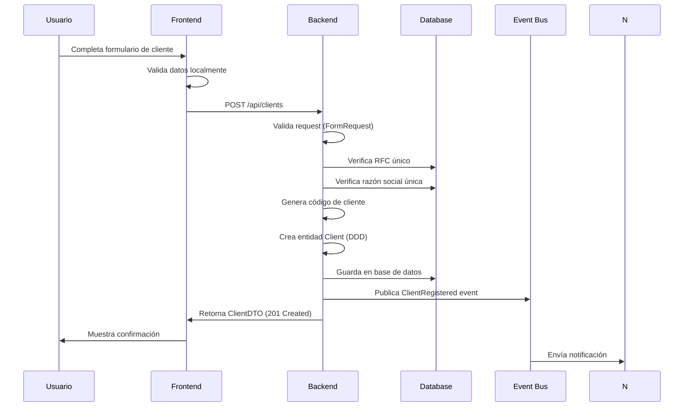
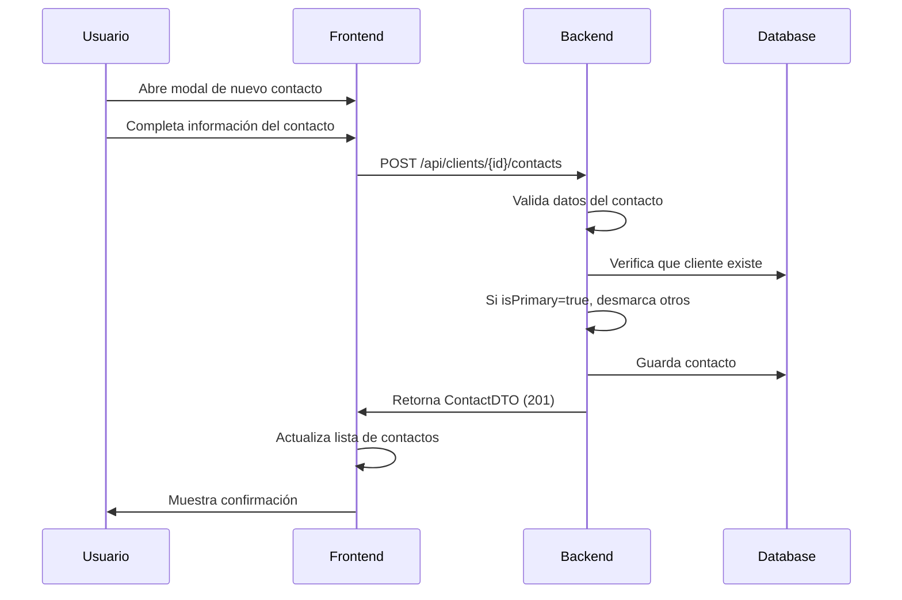
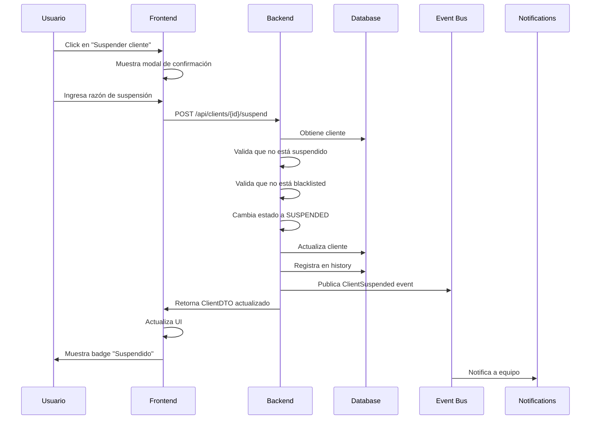
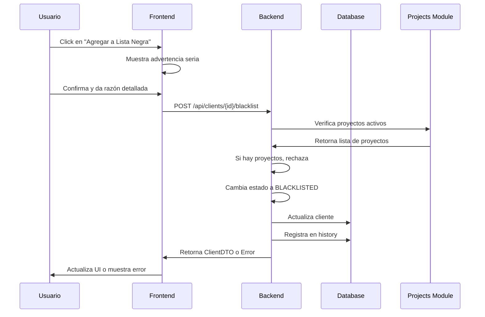
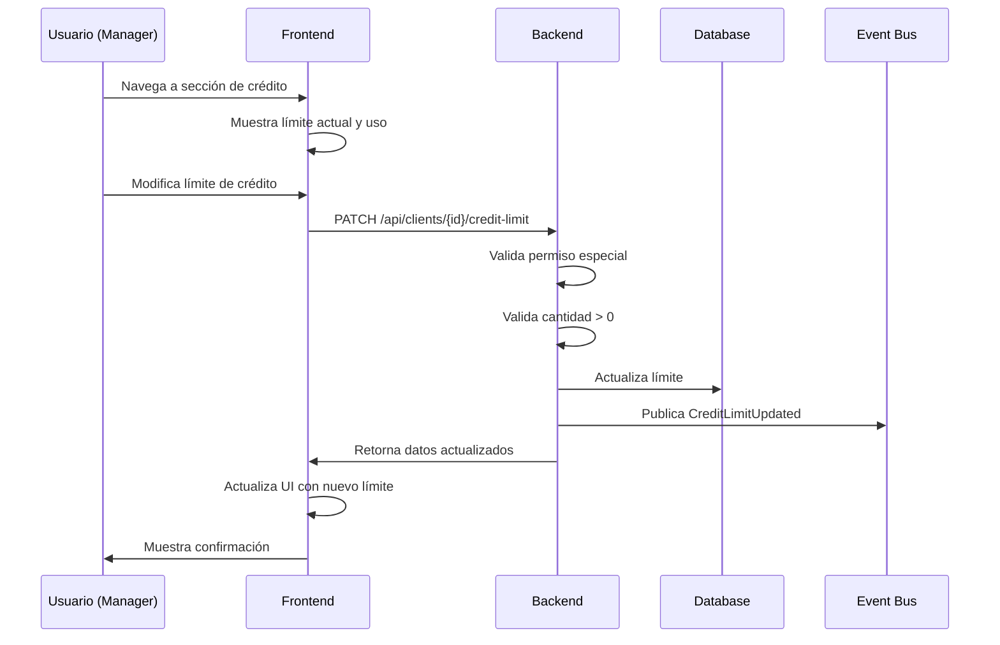
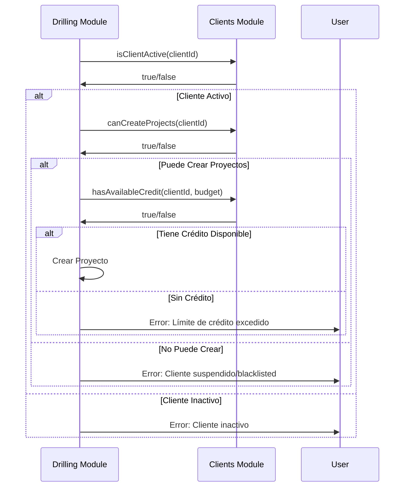

# 📘 Documentación Completa - Módulo de Clientes (Clients)

## 📑 Tabla de Contenidos

1. [Visión General](#1-visión-general)
2. [Arquitectura del Módulo](#2-arquitectura-del-módulo)
3. [Modelo de Dominio](#3-modelo-de-dominio)
4. [Reglas de Negocio](#4-reglas-de-negocio)
5. [Flujos de Trabajo](#5-flujos-de-trabajo)
6. [Validaciones](#6-validaciones)
7. [Estados y Transiciones](#7-estados-y-transiciones)
8. [Criterios de Aceptación](#8-criterios-de-aceptación)
9. [Casos de Uso](#9-casos-de-uso)
10. [Integración con Otros Módulos](#10-integración-con-otros-módulos)
11. [Eventos del Sistema](#11-eventos-del-sistema)
12. [Especificaciones Técnicas](#12-especificaciones-técnicas)

---

## 1. VISIÓN GENERAL

### 1.1 Propósito del Módulo

El módulo de **Clientes** gestiona la información de empresas y organizaciones que contratan servicios de perforación. Es fundamental para:

- Mantener información completa de los clientes
- Gestionar contactos y relaciones comerciales
- Controlar límites de crédito y términos de pago
- Rastrear el historial de estados del cliente
- Validar elegibilidad para crear proyectos

### 1.2 Bounded Context

**ClientManagement** - Gestión integral de clientes y relaciones comerciales

### 1.3 Responsabilidades Clave

- ✅ Registro y actualización de clientes
- ✅ Gestión de múltiples contactos por cliente
- ✅ Control de estados (activo, inactivo, suspendido, blacklist)
- ✅ Administración de límites de crédito
- ✅ Configuración de términos de pago
- ✅ Historial de cambios de estado
- ✅ Validación de información fiscal (México)

---

## 2. ARQUITECTURA DEL MÓDULO

### 2.1 Estructura de Capas

```
app/Modules/Clients/
├── Application/              # Capa de Aplicación
│   ├── Commands/            # Comandos de escritura
│   ├── Contracts/           # Interfaces de aplicación
│   ├── DTOs/               # Data Transfer Objects
│   ├── Exports/            # Exportaciones (Excel, CSV)
│   ├── Mappers/            # Transformadores de datos
│   ├── Queries/            # Consultas de lectura
│   ├── Services/           # Servicios de aplicación
│   └── UseCases/           # Casos de uso
├── Domain/                  # Capa de Dominio (Núcleo)
│   ├── Contracts/          # Interfaces del dominio
│   ├── Entities/           # Entidades del negocio
│   ├── Events/             # Eventos de dominio
│   ├── Exceptions/         # Excepciones del dominio
│   ├── Services/           # Servicios de dominio
│   ├── Specifications/     # Reglas de negocio complejas
│   └── ValueObjects/       # Objetos de valor
├── Infrastructure/          # Capa de Infraestructura
│   ├── Controllers/        # Controladores HTTP
│   ├── Database/           # Migraciones y seeders
│   ├── EventListeners/     # Listeners de eventos
│   ├── Mappers/            # Mappers Eloquent-Dominio
│   ├── Models/             # Modelos Eloquent
│   ├── Repositories/       # Implementación de repositorios
│   └── Routes/             # Definición de rutas
└── Presentation/            # Capa de Presentación
    ├── Requests/           # Validaciones de entrada
    └── Resources/          # Transformadores de respuesta
```

### 2.2 Patrón de Diseño

**Domain-Driven Design (DDD)** con:
- **Agregados**: Client es el agregado raíz
- **Entidades**: ClientContact, ClientStatusHistory
- **Value Objects**: ClientCode, ClientStatus, BusinessInfo, etc.
- **Repository Pattern**: Abstracción de persistencia
- **CQRS Ligero**: Separación de comandos y consultas
- **Event-Driven**: Publicación de eventos de dominio

---

## 3. MODELO DE DOMINIO

### 3.1 Entidad Principal: Client (Agregado Raíz)

**Atributos:**

```typescript
interface Client {
  // Identificadores
  id: string;                     // UUID
  companyId: string;              // UUID del tenant
  clientCode: string;             // CLI-YYYY-#### (auto-generado)
  
  // Información de Negocio
  businessInfo: {
    businessName: string;         // Razón social (único)
    tradeName?: string;           // Nombre comercial
    taxId: string;                // RFC/NIT (único)
    businessType: BusinessType;   // Tipo de negocio
    industry: string;             // Industria/Sector
    website?: string;             // Sitio web
    logoUrl?: string;             // URL del logo
  };
  
  // Información de Contacto
  contactInfo: {
    primaryPhone: string;         // Teléfono principal
    secondaryPhone?: string;      // Teléfono secundario
    primaryEmail: string;         // Email principal
    secondaryEmail?: string;      // Email secundario
    address: Address;             // Dirección física
  };
  
  // Información de Facturación
  billingInfo: {
    billingAddress?: Address;     // Dirección de facturación
    paymentTerms: PaymentTerms;   // Términos de pago
    paymentMethods: PaymentMethod[]; // Métodos de pago aceptados
    creditLimit?: Money;          // Límite de crédito
    taxRegime: string;            // Régimen fiscal
    cfdiUse: string;              // Uso de CFDI (México)
  };
  
  // Estado y Control
  status: ClientStatus;           // Estado del cliente
  contacts: ClientContact[];      // Contactos del cliente
  
  // Auditoría
  createdAt: DateTime;
  updatedAt: DateTime;
  deletedAt?: DateTime;
}
```

**Métodos de Negocio:**

```typescript
// Métodos de Gestión de Estado
activate(): void
deactivate(): void
suspend(reason: string): void
blacklist(reason: string): void

// Métodos de Gestión de Información
updateBusinessInfo(businessInfo: BusinessInfo): void
updateBillingInfo(billingInfo: BillingInfo): void
updateCreditLimit(creditLimit?: Money): void

// Métodos de Gestión de Contactos
addContact(contact: ClientContact): void
removeContact(contactId: string): void

// Métodos de Consulta
isActive(): boolean
canCreateProjects(): boolean
hasAvailableCredit(projectBudget: Money): boolean
getPrimaryContact(): ClientContact?
```

### 3.2 Entidad: ClientContact

**Atributos:**

```typescript
interface ClientContact {
  id: string;                     // UUID
  clientId: string;               // UUID del cliente
  fullName: string;               // Nombre completo
  position: string;               // Cargo/Posición
  department?: string;            // Departamento
  primaryPhone: string;           // Teléfono principal
  secondaryPhone?: string;        // Teléfono secundario
  email: string;                  // Email
  
  // Permisos y Capacidades
  isPrimary: boolean;             // ¿Es contacto principal?
  canApproveProjects: boolean;    // ¿Puede aprobar proyectos?
  canSignDocuments: boolean;      // ¿Puede firmar documentos?
  
  notes?: string;                 // Notas adicionales
  
  // Auditoría
  createdAt: DateTime;
  updatedAt: DateTime;
}
```

**Reglas:**
- Solo puede haber UN contacto primario por cliente
- El contacto primario debe poder aprobar proyectos
- No se puede eliminar el único contacto de un cliente
- No se puede eliminar el contacto primario sin asignar otro primero

### 3.3 Entidad: ClientStatusHistory

**Atributos:**

```typescript
interface ClientStatusHistory {
  id: string;                     // UUID
  clientId: string;               // UUID del cliente
  previousStatus?: ClientStatus;  // Estado anterior
  newStatus: ClientStatus;        // Estado nuevo
  changeDate: DateTime;           // Fecha del cambio
  reason?: string;                // Razón del cambio
  changedBy: string;              // UUID del usuario
  
  createdAt: DateTime;
}
```

### 3.4 Value Objects

#### ClientStatus (Enum)

```typescript
enum ClientStatus {
  ACTIVE = 'active',              // Cliente activo
  INACTIVE = 'inactive',          // Cliente inactivo
  SUSPENDED = 'suspended',        // Cliente suspendido
  BLACKLISTED = 'blacklisted'     // Cliente en lista negra
}

// Métodos
isActive(): boolean
canCreateProjects(): boolean      // Solo ACTIVE puede crear proyectos
```

#### BusinessType (Enum)

```typescript
enum BusinessType {
  INDIVIDUAL = 'individual',      // Persona física
  COMPANY = 'company',            // Empresa
  GOVERNMENT = 'government',      // Gobierno
  NGO = 'ngo'                     // ONG
}
```

#### PaymentTerms (Enum)

```typescript
enum PaymentTerms {
  IMMEDIATE = 'immediate',        // Pago inmediato (0 días)
  NET_15 = 'net_15',             // Net 15 días
  NET_30 = 'net_30',             // Net 30 días
  NET_60 = 'net_60',             // Net 60 días
  CUSTOM = 'custom'              // Personalizado
}
```

#### PaymentMethod (Enum)

```typescript
enum PaymentMethod {
  CASH = 'cash',                  // Efectivo
  CHECK = 'check',                // Cheque
  BANK_TRANSFER = 'bank_transfer', // Transferencia bancaria
  CREDIT_CARD = 'credit_card',    // Tarjeta de crédito
  FINANCING = 'financing'         // Financiamiento
}
```

#### Address (Value Object)

```typescript
interface Address {
  addressLine1: string;           // Línea 1
  addressLine2?: string;          // Línea 2
  city: string;                   // Ciudad
  state: string;                  // Estado/Provincia
  postalCode: string;             // Código postal
  country: string;                // País
}
```

---

## 4. REGLAS DE NEGOCIO

### 4.1 Reglas de Unicidad

**RN-CLI-001**: Código de cliente único por tenant
- ✅ El sistema genera automáticamente códigos únicos
- ✅ Formato: `CLI-YYYY-####` (ej: CLI-2025-0001)

**RN-CLI-002**: Razón social única por tenant
- ✅ No puede haber dos clientes con la misma razón social
- ✅ La comparación es case-insensitive
- ✅ Error 409 Conflict si ya existe

**RN-CLI-003**: RFC/NIT único por tenant
- ✅ No puede haber dos clientes con el mismo RFC/NIT
- ✅ Validación de formato según país (México: RFC)
- ✅ Error 409 Conflict si ya existe

### 4.2 Reglas de Estado

**RN-CLI-004**: Cliente suspendido no puede crear nuevos proyectos
- ✅ Al suspender, proyectos activos pueden continuar
- ✅ No se pueden crear nuevos proyectos mientras esté suspendido
- ✅ Se puede reactivar para permitir nuevos proyectos

**RN-CLI-005**: Cliente blacklisted no puede tener proyectos activos
- ✅ Proyectos activos deben completarse o cancelarse
- ✅ No se pueden crear nuevos proyectos
- ✅ Estado más restrictivo del sistema

**RN-CLI-006**: Cliente debe tener al menos un contacto
- ✅ No se puede eliminar el único contacto
- ✅ Al crear cliente, se debe agregar contacto principal
- ✅ Error si se intenta eliminar último contacto

**RN-CLI-007**: Cliente debe tener exactamente un contacto primario
- ✅ Solo un contacto puede ser marcado como primario
- ✅ Al cambiar primario, el anterior se desmarca automáticamente
- ✅ No se puede eliminar contacto primario sin asignar otro

### 4.3 Reglas de Crédito

**RN-CLI-008**: Límite de crédito debe ser mayor a 0 si se establece
- ✅ Si se configura límite de crédito, debe ser > 0
- ✅ Null significa crédito ilimitado
- ✅ Se valida en moneda específica (MXN, USD, etc)

**RN-CLI-009**: No se puede exceder límite de crédito al crear proyecto
- ✅ Sistema valida crédito disponible antes de crear proyecto
- ✅ Se considera suma de proyectos activos
- ✅ Error 422 si excede límite

**RN-CLI-010**: No se puede eliminar cliente con proyectos activos
- ✅ Solo se puede hacer soft delete si no hay proyectos activos
- ✅ Se debe completar o cancelar proyectos primero
- ✅ Error 422 con lista de proyectos activos

**RN-CLI-011**: Contacto primario debe poder aprobar proyectos
- ✅ El contacto principal siempre tiene `canApproveProjects = true`
- ✅ Se valida al cambiar contacto primario
- ✅ Se actualiza automáticamente si es necesario

### 4.4 Reglas de Información Fiscal (México)

**RN-CLI-012**: RFC debe tener formato válido
- ✅ Persona física: 13 caracteres
- ✅ Persona moral: 12 caracteres
- ✅ Validación de estructura y dígito verificador

**RN-CLI-013**: Régimen fiscal es obligatorio
- ✅ Catálogo del SAT (601, 603, 605, etc)
- ✅ Debe corresponder al tipo de persona

**RN-CLI-014**: Uso de CFDI es obligatorio
- ✅ Catálogo del SAT (G01, G03, P01, etc)
- ✅ Define el uso que se dará a la factura

---

## 5. FLUJOS DE TRABAJO

### 5.1 Flujo: Registro de Nuevo Cliente



**Pasos Detallados:**

1. **Usuario completa formulario**
   - Información de negocio (razón social, RFC, etc)
   - Información de contacto (dirección, teléfonos, emails)
   - Información de facturación (términos de pago, límite de crédito)

2. **Validación Frontend**
   - Campos requeridos completos
   - Formato de email válido
   - Formato de RFC válido
   - Teléfono con formato correcto

3. **Validación Backend**
   - RFC único en tenant
   - Razón social única en tenant
   - Email válido
   - Régimen fiscal válido
   - Uso de CFDI válido

4. **Generación Automática**
   - Código de cliente: CLI-2025-0001
   - Estado inicial: ACTIVE
   - Fechas de auditoría

5. **Persistencia**
   - Guarda cliente en BD
   - Registra en history (estado inicial)

6. **Eventos**
   - ClientRegistered publicado
   - Notificaciones enviadas

### 5.2 Flujo: Agregar Contacto a Cliente



**Pasos Detallados:**

1. **Captura de Datos**
   - Nombre completo (requerido)
   - Cargo/Posición (requerido)
   - Departamento (opcional)
   - Teléfonos (principal requerido)
   - Email (requerido)
   - Permisos (checkboxes)

2. **Validación de Permisos**
   - ¿Es contacto principal?
   - ¿Puede aprobar proyectos?
   - ¿Puede firmar documentos?

3. **Lógica de Contacto Principal**
   - Si `isPrimary = true`:
     - Desmarcar contacto principal anterior
     - Marcar nuevo como principal
     - Asegurar `canApproveProjects = true`

4. **Eventos**
   - ClientContactAdded publicado

### 5.3 Flujo: Suspender Cliente



**Validaciones:**
- ✅ Cliente debe existir
- ✅ Cliente no debe estar ya suspendido
- ✅ Cliente no debe estar blacklisted
- ✅ Razón de suspensión es requerida (min 10 caracteres)

**Efectos:**
- ✅ Cliente no puede crear nuevos proyectos
- ✅ Proyectos activos pueden continuar
- ✅ Notificación al equipo comercial
- ✅ Registro en historial de estados

### 5.4 Flujo: Blacklist de Cliente



**Validaciones Críticas:**
- ✅ Cliente no debe tener proyectos activos
- ✅ Razón detallada es obligatoria (min 20 caracteres)
- ✅ Solo usuarios con permiso especial
- ✅ Requiere confirmación doble

**Efectos:**
- ✅ Cliente no puede crear proyectos
- ✅ Aparece en reportes de clientes problemáticos
- ✅ Notificación a dirección general
- ✅ No reversible sin autorización

### 5.5 Flujo: Actualizar Límite de Crédito



**Validaciones:**
- ✅ Usuario debe tener permiso `clients.credit.manage`
- ✅ Si se establece límite, debe ser > 0
- ✅ Se debe especificar moneda (MXN, USD, etc)

**Cálculo de Crédito Disponible:**
```
Crédito Disponible = Límite Total - Σ(Presupuestos Proyectos Activos)
```

---

## 6. VALIDACIONES

### 6.1 Validaciones de Campos

#### Información de Negocio

| Campo | Validación | Ejemplo | Mensaje de Error |
|-------|-----------|---------|-----------------|
| `business_name` | requerido, min:3, max:255, único | "Constructora ABC S.A." | "La razón social ya está registrada" |
| `trade_name` | opcional, max:255 | "ABC Construcciones" | - |
| `tax_id` | requerido, formato RFC, único | "ABC850101A1B" | "El RFC ya está registrado" |
| `business_type` | requerido, enum | "company" | "Tipo de negocio inválido" |
| `industry` | requerido, max:100 | "Construcción" | - |
| `website` | opcional, url válida | "https://abc.com" | "URL inválida" |
| `logo_url` | opcional, url válida | "https://cdn.abc.com/logo.png" | "URL de logo inválida" |

#### Información de Contacto

| Campo | Validación | Ejemplo | Mensaje de Error |
|-------|-----------|---------|-----------------|
| `primary_phone` | requerido, max:20 | "6621234567" | "Teléfono principal requerido" |
| `secondary_phone` | opcional, max:20 | "6629876543" | - |
| `primary_email` | requerido, email | "contacto@abc.com" | "Email inválido" |
| `secondary_email` | opcional, email | "ventas@abc.com" | "Email secundario inválido" |
| `address_line_1` | requerido, max:255 | "Calle Principal 123" | - |
| `city` | requerido, max:100 | "Hermosillo" | - |
| `state` | requerido, max:100 | "Sonora" | - |
| `postal_code` | requerido, max:20 | "83000" | - |
| `country` | opcional, max:100, default: "México" | "México" | - |

#### Información de Facturación

| Campo | Validación | Ejemplo | Mensaje de Error |
|-------|-----------|---------|-----------------|
| `payment_terms` | requerido, enum | "net_30" | "Términos de pago inválidos" |
| `payment_methods` | requerido, array, min:1 | ["bank_transfer", "check"] | "Debe tener al menos un método de pago" |
| `credit_limit` | opcional, numeric, min:0 | 50000.00 | "Límite de crédito debe ser mayor a 0" |
| `credit_limit_currency` | requerido si credit_limit, size:3 | "MXN" | "Moneda inválida" |
| `tax_regime` | requerido, max:100 | "601" | "Régimen fiscal requerido" |
| `cfdi_use` | requerido, max:100 | "G03" | "Uso de CFDI requerido" |

#### Contactos

| Campo | Validación | Ejemplo | Mensaje de Error |
|-------|-----------|---------|-----------------|
| `full_name` | requerido, min:3, max:200 | "Juan Pérez García" | - |
| `position` | requerido, min:2, max:100 | "Director General" | - |
| `department` | opcional, max:100 | "Administración" | - |
| `primary_phone` | requerido, max:20 | "6621234567" | - |
| `email` | requerido, email | "jperez@abc.com" | "Email inválido" |
| `is_primary` | boolean, default: false | true | - |
| `can_approve_projects` | boolean, default: false | true | - |
| `can_sign_documents` | boolean, default: false | false | - |

### 6.2 Validaciones de Negocio

#### Al Crear Cliente

```typescript
// Pseudo-código de validaciones
if (existsClientWithTaxId(taxId)) {
  throw ConflictError("Ya existe un cliente con este RFC/NIT", 409);
}

if (existsClientWithBusinessName(businessName)) {
  throw ConflictError("Ya existe un cliente con esta razón social", 409);
}

if (creditLimit && creditLimit <= 0) {
  throw ValidationError("El límite de crédito debe ser mayor a 0", 422);
}

if (paymentMethods.length === 0) {
  throw ValidationError("Debe seleccionar al menos un método de pago", 422);
}
```

#### Al Suspender Cliente

```typescript
if (client.status === 'suspended') {
  throw BusinessRuleError("El cliente ya está suspendido", 422);
}

if (client.status === 'blacklisted') {
  throw BusinessRuleError("No se puede suspender un cliente en lista negra", 422);
}

if (!reason || reason.length < 10) {
  throw ValidationError("La razón de suspensión debe tener al menos 10 caracteres", 422);
}
```

#### Al Blacklist Cliente

```typescript
const activeProjects = await getActiveProjectsByClient(clientId);

if (activeProjects.length > 0) {
  throw BusinessRuleError(
    `No se puede agregar a lista negra. El cliente tiene ${activeProjects.length} proyecto(s) activo(s)`,
    422,
    { activeProjects: activeProjects.map(p => p.id) }
  );
}

if (!reason || reason.length < 20) {
  throw ValidationError("La razón debe ser detallada (mínimo 20 caracteres)", 422);
}
```

---

## 7. ESTADOS Y TRANSICIONES

### 7.1 Diagrama de Estados

```
┌─────────────────────────────────────────────────────────┐
│                    CICLO DE VIDA DEL CLIENTE             │
└─────────────────────────────────────────────────────────┘

                    [CREAR CLIENTE]
                           │
                           ▼
                      ┌─────────┐
                      │ ACTIVE  │ ◄──────┐
                      └─────────┘        │
                           │             │
                           │             │ reactivate()
                           │             │
         ┌─────────────────┼─────────────┼──────────────┐
         │                 │             │              │
         │ suspend()       │ deactivate()│              │
         │                 │             │              │
         ▼                 ▼             │              │
    ┌───────────┐     ┌──────────┐      │              │
    │ SUSPENDED │     │ INACTIVE │──────┘              │
    └───────────┘     └──────────┘                     │
         │                                              │
         │ blacklist()                                  │
         │                                              │
         ▼                                              │
    ┌──────────────┐                                   │
    │ BLACKLISTED  │◄──────────────────────────────────┘
    └──────────────┘        blacklist()
```

### 7.2 Transiciones Permitidas

| Estado Actual | Acción | Estado Final | Condiciones |
|--------------|--------|--------------|-------------|
| ACTIVE | `suspend()` | SUSPENDED | Requiere razón |
| ACTIVE | `deactivate()` | INACTIVE | Sin proyectos activos |
| ACTIVE | `blacklist()` | BLACKLISTED | Sin proyectos activos + razón detallada |
| SUSPENDED | `activate()` | ACTIVE | - |
| SUSPENDED | `blacklist()` | BLACKLISTED | Sin proyectos activos + razón detallada |
| INACTIVE | `activate()` | ACTIVE | - |
| BLACKLISTED | - | - | **No reversible** sin autorización especial |

### 7.3 Capacidades por Estado

| Capacidad | ACTIVE | INACTIVE | SUSPENDED | BLACKLISTED |
|-----------|--------|----------|-----------|-------------|
| Crear proyectos | ✅ | ❌ | ❌ | ❌ |
| Ver proyectos existentes | ✅ | ✅ | ✅ | ✅ |
| Continuar proyectos activos | ✅ | ✅ | ✅ | ❌ |
| Modificar información | ✅ | ✅ | ✅ | ⚠️ (limitado) |
| Recibir notificaciones | ✅ | ⚠️ | ✅ | ⚠️ |

---

## 8. CRITERIOS DE ACEPTACIÓN

### 8.1 Historia de Usuario: Registrar Cliente

**Como** gerente comercial  
**Quiero** registrar un nuevo cliente en el sistema  
**Para** poder asignarle proyectos de perforación

**Criterios de Aceptación:**

✅ **CA-1**: El sistema debe generar automáticamente un código único de cliente
- Formato: CLI-YYYY-####
- Secuencial por año
- No se puede modificar manualmente

✅ **CA-2**: El sistema debe validar que el RFC/NIT sea único
- Si ya existe, mostrar error específico
- Mensaje: "Ya existe un cliente con este RFC/NIT"
- Status HTTP 409 Conflict

✅ **CA-3**: El sistema debe validar que la razón social sea única
- Comparación case-insensitive
- Si ya existe, mostrar error específico

✅ **CA-4**: El estado inicial del cliente debe ser "ACTIVE"
- Automático al crear
- Visible en la interfaz con badge verde

✅ **CA-5**: El sistema debe validar el formato del RFC
- Persona física: 13 caracteres
- Persona moral: 12 caracteres
- Mostrar error si formato inválido

✅ **CA-6**: El sistema debe permitir configurar términos de pago
- Opciones: immediate, net_15, net_30, net_60, custom
- Valor por defecto: net_30

✅ **CA-7**: El sistema debe permitir múltiples métodos de pago
- Al menos uno requerido
- Opciones: efectivo, cheque, transferencia, tarjeta, financiamiento

✅ **CA-8**: El límite de crédito debe ser opcional
- Si se establece, debe ser mayor a 0
- Se debe especificar la moneda (MXN, USD, etc)

✅ **CA-9**: La información fiscal debe ser obligatoria (México)
- Régimen fiscal: requerido
- Uso de CFDI: requerido

✅ **CA-10**: El sistema debe registrar automáticamente la creación en el historial
- Tipo de cambio: "created"
- Estado: "active"
- Usuario que creó

### 8.2 Historia de Usuario: Suspender Cliente

**Como** gerente de crédito  
**Quiero** suspender un cliente con pagos atrasados  
**Para** evitar que se le asignen nuevos proyectos

**Criterios de Aceptación:**

✅ **CA-1**: El sistema debe solicitar una razón obligatoria
- Mínimo 10 caracteres
- Campo de texto largo (textarea)

✅ **CA-2**: El sistema debe cambiar el estado a "SUSPENDED"
- Badge amarillo/naranja
- Texto: "Suspendido"

✅ **CA-3**: El sistema debe impedir crear nuevos proyectos
- Validación en backend
- Mensaje claro al intentar crear proyecto

✅ **CA-4**: Los proyectos activos deben poder continuar
- No se interrumpen
- Solo se bloquean nuevos proyectos

✅ **CA-5**: El sistema debe registrar el cambio en el historial
- Estado anterior: "active"
- Estado nuevo: "suspended"
- Razón de la suspensión
- Usuario que realizó la acción
- Fecha y hora

✅ **CA-6**: El sistema debe enviar notificaciones
- Al equipo comercial
- Al contacto principal del cliente (opcional)

✅ **CA-7**: El cliente suspendido debe poder reactivarse
- Acción: "Reactivar Cliente"
- Requiere permiso especial
- Cambia estado a "ACTIVE"

### 8.3 Historia de Usuario: Gestionar Contactos

**Como** gerente de cuenta  
**Quiero** agregar múltiples contactos a un cliente  
**Para** tener la información de todas las personas clave

**Criterios de Aceptación:**

✅ **CA-1**: El sistema debe permitir agregar múltiples contactos
- No hay límite de cantidad
- Cada contacto tiene su propio formulario

✅ **CA-2**: El sistema debe permitir marcar un contacto como principal
- Solo uno puede ser principal
- Al marcar nuevo, el anterior se desmarca

✅ **CA-3**: El contacto principal debe poder aprobar proyectos
- Campo `canApproveProjects` automáticamente true
- No se puede desmarcar

✅ **CA-4**: El sistema debe mostrar claramente el contacto principal
- Badge o indicador visual
- Al inicio de la lista

✅ **CA-5**: El sistema no debe permitir eliminar el único contacto
- Validación en backend
- Mensaje: "No puede eliminar el único contacto del cliente"

✅ **CA-6**: El sistema no debe permitir eliminar el contacto principal directamente
- Mensaje: "Debe asignar otro contacto principal antes de eliminar este"

✅ **CA-7**: El sistema debe validar email único por cliente
- Advertencia si se repite (no bloqueante)

✅ **CA-8**: El sistema debe mostrar permisos claramente
- ¿Puede aprobar proyectos?
- ¿Puede firmar documentos?
- Checkboxes o toggles

---

## 9. CASOS DE USO

### 9.1 Casos de Uso - Comandos (Escritura)

#### CU-01: Register Client

**Actor**: Gerente Comercial, Admin

**Precondiciones**:
- Usuario autenticado
- Usuario tiene permiso `clients.create`

**Flujo Principal**:
1. Usuario accede a "Nuevo Cliente"
2. Sistema muestra formulario
3. Usuario completa información de negocio
4. Usuario completa información de contacto
5. Usuario completa información de facturación
6. Usuario presiona "Guardar"
7. Sistema valida datos
8. Sistema verifica RFC único
9. Sistema verifica razón social única
10. Sistema genera código de cliente
11. Sistema crea cliente con estado ACTIVE
12. Sistema registra en historial
13. Sistema publica evento ClientRegistered
14. Sistema retorna cliente creado

**Flujo Alternativo 7a**: Validación falla
- Sistema muestra errores específicos por campo
- Usuario corrige y reintenta

**Flujo Alternativo 8a**: RFC ya existe
- Sistema muestra error 409 Conflict
- Sistema indica el código del cliente existente
- Usuario verifica si es duplicado o error

**Postcondiciones**:
- Cliente creado en estado ACTIVE
- Código único generado
- Evento ClientRegistered publicado
- Usuario ve confirmación con código de cliente

#### CU-02: Update Client

**Actor**: Gerente Comercial, Admin

**Precondiciones**:
- Usuario autenticado
- Usuario tiene permiso `clients.update`
- Cliente existe

**Flujo Principal**:
1. Usuario busca y selecciona cliente
2. Sistema muestra datos actuales
3. Usuario modifica campos deseados
4. Usuario presiona "Actualizar"
5. Sistema valida cambios
6. Sistema actualiza cliente
7. Sistema publica evento ClientUpdated
8. Sistema retorna cliente actualizado

**Restricciones**:
- No se puede cambiar: `id`, `company_id`, `client_code`
- Si se cambia RFC, validar único
- Si se cambia razón social, validar único

#### CU-03: Deactivate Client

**Actor**: Gerente de Cuenta, Admin

**Precondiciones**:
- Cliente en estado ACTIVE
- Cliente no tiene proyectos activos

**Flujo Principal**:
1. Usuario selecciona cliente
2. Usuario presiona "Desactivar"
3. Sistema solicita confirmación
4. Usuario confirma
5. Sistema verifica no tiene proyectos activos
6. Sistema cambia estado a INACTIVE
7. Sistema registra en historial
8. Sistema publica evento ClientDeactivated

**Flujo Alternativo 5a**: Tiene proyectos activos
- Sistema muestra error
- Sistema lista proyectos activos
- Usuario debe completar proyectos primero

#### CU-04: Suspend Client

**Actor**: Gerente de Crédito, Admin

**Precondiciones**:
- Cliente en estado ACTIVE
- Usuario tiene permiso `clients.suspend`

**Flujo Principal**:
1. Usuario selecciona cliente
2. Usuario presiona "Suspender"
3. Sistema muestra modal con campo de razón
4. Usuario ingresa razón (min 10 caracteres)
5. Usuario confirma
6. Sistema cambia estado a SUSPENDED
7. Sistema registra en historial con razón
8. Sistema publica evento ClientSuspended
9. Sistema envía notificaciones

**Efectos**:
- Cliente no puede crear nuevos proyectos
- Proyectos activos continúan
- Aparece badge "Suspendido"

#### CU-05: Blacklist Client

**Actor**: Director General, Admin

**Precondiciones**:
- Cliente no en estado BLACKLISTED
- Cliente no tiene proyectos activos
- Usuario tiene permiso `clients.blacklist`

**Flujo Principal**:
1. Usuario selecciona cliente
2. Usuario presiona "Agregar a Lista Negra"
3. Sistema muestra advertencia seria
4. Usuario ingresa razón detallada (min 20 caracteres)
5. Usuario confirma doble
6. Sistema verifica no tiene proyectos activos
7. Sistema cambia estado a BLACKLISTED
8. Sistema registra en historial
9. Sistema publica evento ClientBlacklisted
10. Sistema envía notificaciones a dirección

**Flujo Alternativo 6a**: Tiene proyectos activos
- Sistema rechaza operación
- Sistema muestra lista de proyectos
- Mensaje: "Debe completar o cancelar proyectos primero"

**Efectos**:
- Cliente no puede crear proyectos
- Aparece en reportes de clientes problemáticos
- Requiere autorización especial para revertir

#### CU-06: Add Client Contact

**Actor**: Gerente de Cuenta, Admin

**Precondiciones**:
- Cliente existe
- Usuario tiene permiso `clients.contacts.manage`

**Flujo Principal**:
1. Usuario accede a sección de contactos
2. Usuario presiona "Agregar Contacto"
3. Sistema muestra formulario
4. Usuario completa datos del contacto
5. Usuario marca permisos (opcional)
6. Usuario marca como primario (opcional)
7. Usuario presiona "Guardar"
8. Sistema valida datos
9. Si es primario, desmarca contacto principal anterior
10. Sistema guarda contacto
11. Sistema publica evento ClientContactAdded
12. Sistema retorna contacto creado

**Validaciones Especiales**:
- Si `isPrimary = true`, automáticamente `canApproveProjects = true`
- Email válido
- Teléfono principal obligatorio

#### CU-07: Update Credit Limit

**Actor**: Gerente de Crédito, Admin

**Precondiciones**:
- Cliente existe
- Usuario tiene permiso `clients.credit.manage`

**Flujo Principal**:
1. Usuario accede a sección de crédito
2. Sistema muestra límite actual y uso
3. Usuario ingresa nuevo límite
4. Usuario selecciona moneda
5. Usuario presiona "Actualizar"
6. Sistema valida límite > 0
7. Sistema actualiza límite
8. Sistema publica evento CreditLimitUpdated
9. Sistema recalcula crédito disponible

**Cálculos**:
```
Crédito Usado = Σ(Presupuestos Proyectos Activos)
Crédito Disponible = Límite - Crédito Usado
% Utilización = (Crédito Usado / Límite) × 100
```

### 9.2 Casos de Uso - Consultas (Lectura)

#### CU-08: Get Client by ID

**Actor**: Cualquier usuario autenticado

**Precondiciones**:
- Usuario autenticado
- Usuario tiene permiso `clients.view`

**Flujo Principal**:
1. Usuario solicita ver cliente
2. Sistema busca cliente por ID
3. Sistema verifica pertenece al tenant
4. Sistema retorna datos completos

**Respuesta**:
- Información de negocio
- Información de contacto
- Información de facturación
- Lista de contactos
- Estadísticas básicas

#### CU-09: Search Clients

**Actor**: Cualquier usuario autenticado

**Precondiciones**:
- Usuario tiene permiso `clients.view`

**Flujo Principal**:
1. Usuario accede a lista de clientes
2. Sistema muestra clientes del tenant
3. Usuario aplica filtros (opcional)
4. Sistema retorna resultados paginados

**Filtros Disponibles**:
- Nombre del negocio
- RFC/NIT
- Estado (active, inactive, suspended, blacklisted)
- Tipo de negocio
- Industria
- Rango de fechas de creación

**Ordenamiento**:
- Por nombre (A-Z, Z-A)
- Por fecha de creación (más reciente, más antiguo)
- Por estado

#### CU-10: Get Client Contacts

**Actor**: Cualquier usuario autenticado

**Precondiciones**:
- Cliente existe
- Usuario tiene permiso `clients.view`

**Flujo Principal**:
1. Usuario solicita contactos de cliente
2. Sistema busca contactos del cliente
3. Sistema retorna lista ordenada
4. Contacto primario aparece primero

---

## 10. INTEGRACIÓN CON OTROS MÓDULOS

### 10.1 Integración con Identity Module

**Dependencia**: Autenticación y Autorización

```typescript
interface IUserQueryService {
  getCurrentUser(): UserBasicInfoDTO;
  userHasPermission(userId: string, permission: string): boolean;
}
```

**Permisos del Módulo**:
```
clients.view                    // Ver clientes
clients.create                  // Crear clientes
clients.update                  // Actualizar clientes
clients.delete                  // Eliminar clientes
clients.suspend                 // Suspender clientes
clients.blacklist               // Agregar a lista negra
clients.contacts.manage         // Gestionar contactos
clients.credit.manage           // Gestionar crédito
clients.view_financial          // Ver información financiera sensible
```

### 10.2 Integración con Drilling Module

**Dependencia**: Validación de elegibilidad

```typescript
// Drilling Module consulta antes de crear proyecto
interface IClientQueryService {
  getClientBasicInfo(clientId: string): ClientBasicInfoDTO;
  isClientActive(clientId: string): boolean;
  canCreateProjects(clientId: string): boolean;
  hasAvailableCredit(clientId: string, projectBudget: Money): boolean;
}
```

**Flujo de Validación**:


### 10.3 Integración con Notifications Module

**Dependencia**: Envío de notificaciones

**Eventos que Disparan Notificaciones**:

1. **ClientRegistered**
   - Notificar a: Equipo comercial
   - Canal: Email, In-App
   - Plantilla: "Nuevo cliente registrado"

2. **ClientSuspended**
   - Notificar a: Gerente de crédito, Gerente comercial
   - Canal: Email, In-App
   - Plantilla: "Cliente suspendido"
   - Prioridad: Alta

3. **ClientBlacklisted**
   - Notificar a: Dirección general, Gerente de crédito
   - Canal: Email, SMS, In-App
   - Plantilla: "Cliente agregado a lista negra"
   - Prioridad: Crítica

4. **ClientCreditLimitUpdated**
   - Notificar a: Gerente de crédito
   - Canal: In-App
   - Plantilla: "Límite de crédito actualizado"

### 10.4 Integración con Reports Module

**Dependencia**: Estadísticas y reportes

**Consultas Disponibles**:
- Total de clientes por estado
- Clientes creados en rango de fechas
- Utilización de crédito por cliente
- Clientes con proyectos activos
- Clientes sin actividad reciente

---

## 11. EVENTOS DEL SISTEMA

### 11.1 Eventos de Dominio

#### ClientRegistered

**Cuándo se Dispara**: Al crear un nuevo cliente

**Payload**:
```typescript
{
  eventId: string;
  occurredOn: DateTime;
  clientId: string;
  companyId: string;
  clientCode: string;
  businessName: string;
  taxId: string;
}
```

**Listeners**:
- `RecordClientStatusHistoryListener`: Registra estado inicial
- `NotifyNewClientListener`: Envía notificación
- `UpdateStatisticsListener`: Actualiza contadores

#### ClientStatusChanged

**Cuándo se Dispara**: Al cambiar el estado del cliente

**Payload**:
```typescript
{
  eventId: string;
  occurredOn: DateTime;
  clientId: string;
  companyId: string;
  oldStatus: ClientStatus;
  newStatus: ClientStatus;
  reason?: string;
  changedBy: string;
}
```

**Listeners**:
- `RecordClientStatusHistoryListener`: Registra cambio
- `NotifyStatusChangeListener`: Envía notificación
- `ValidateProjectsListener`: Valida impacto en proyectos

#### ClientSuspended

**Cuándo se Dispara**: Al suspender un cliente

**Payload**:
```typescript
{
  eventId: string;
  occurredOn: DateTime;
  clientId: string;
  companyId: string;
  reason: string;
  suspendedAt: DateTime;
  suspendedBy: string;
}
```

**Listeners**:
- `BlockNewProjectsListener`: Bloquea creación de proyectos
- `NotifyTeamListener`: Notifica a equipo comercial
- `UpdateDashboardListener`: Actualiza métricas

#### ClientBlacklisted

**Cuándo se Dispara**: Al agregar cliente a lista negra

**Payload**:
```typescript
{
  eventId: string;
  occurredOn: DateTime;
  clientId: string;
  companyId: string;
  reason: string;
  blacklistedAt: DateTime;
  blacklistedBy: string;
}
```

**Listeners**:
- `BlockAllProjectsListener`: Bloquea todos los proyectos
- `NotifyManagementListener`: Notifica a dirección
- `FlagClientListener`: Marca en reportes
- `AuditLogListener`: Registra en auditoría

#### ClientContactAdded

**Cuándo se Dispara**: Al agregar un contacto

**Payload**:
```typescript
{
  eventId: string;
  occurredOn: DateTime;
  clientId: string;
  contactId: string;
  fullName: string;
  email: string;
  isPrimary: boolean;
}
```

**Listeners**:
- `NotifyContactListener`: Envía email de bienvenida (opcional)
- `UpdateCRMListener`: Sincroniza con CRM externo

#### ClientCreditLimitUpdated

**Cuándo se Dispara**: Al actualizar límite de crédito

**Payload**:
```typescript
{
  eventId: string;
  occurredOn: DateTime;
  clientId: string;
  companyId: string;
  oldLimit?: Money;
  newLimit?: Money;
  updatedBy: string;
}
```

**Listeners**:
- `RecalculateAvailableCreditListener`: Recalcula crédito
- `NotifyCreditTeamListener`: Notifica a finanzas
- `AuditCreditChangeListener`: Registra cambio

---

## 12. ESPECIFICACIONES TÉCNICAS

### 12.1 Modelos de Base de Datos

#### Tabla: clients_clients

```sql
CREATE TABLE clients_clients (
    id UUID PRIMARY KEY,
    company_id UUID NOT NULL,
    client_code VARCHAR(20) NOT NULL,
    
    -- Business Info
    business_name VARCHAR(255) NOT NULL,
    trade_name VARCHAR(255),
    tax_id VARCHAR(20) NOT NULL,
    business_type VARCHAR(50) NOT NULL,
    industry VARCHAR(100) NOT NULL,
    website VARCHAR(255),
    logo_url VARCHAR(500),
    
    -- Contact Info
    primary_phone VARCHAR(20) NOT NULL,
    secondary_phone VARCHAR(20),
    primary_email VARCHAR(255) NOT NULL,
    secondary_email VARCHAR(255),
    address_line_1 VARCHAR(255) NOT NULL,
    address_line_2 VARCHAR(255),
    city VARCHAR(100) NOT NULL,
    state VARCHAR(100) NOT NULL,
    postal_code VARCHAR(20) NOT NULL,
    country VARCHAR(100) NOT NULL,
    
    -- Billing Info
    billing_address_line_1 VARCHAR(255),
    billing_address_line_2 VARCHAR(255),
    billing_city VARCHAR(100),
    billing_state VARCHAR(100),
    billing_postal_code VARCHAR(20),
    billing_country VARCHAR(100),
    payment_terms VARCHAR(50) NOT NULL,
    payment_methods JSON NOT NULL,
    credit_limit_amount DECIMAL(15,2),
    credit_limit_currency VARCHAR(3),
    tax_regime VARCHAR(100) NOT NULL,
    cfdi_use VARCHAR(100) NOT NULL,
    
    -- Status
    status VARCHAR(50) NOT NULL DEFAULT 'active',
    
    -- Audit
    created_at TIMESTAMP DEFAULT CURRENT_TIMESTAMP,
    updated_at TIMESTAMP DEFAULT CURRENT_TIMESTAMP ON UPDATE CURRENT_TIMESTAMP,
    deleted_at TIMESTAMP,
    
    -- Indexes
    INDEX idx_tenant (company_id),
    INDEX idx_client_code (client_code),
    INDEX idx_tax_id (tax_id),
    INDEX idx_business_name (business_name),
    INDEX idx_status (status),
    UNIQUE KEY uk_company_client_code (company_id, client_code),
    UNIQUE KEY uk_company_tax_id (company_id, tax_id),
    UNIQUE KEY uk_company_business_name (company_id, business_name),
    
    -- Foreign Keys
    FOREIGN KEY (company_id) REFERENCES tenants(id) ON DELETE CASCADE
);
```

#### Tabla: clients_contacts

```sql
CREATE TABLE clients_contacts (
    id UUID PRIMARY KEY,
    client_id UUID NOT NULL,
    full_name VARCHAR(200) NOT NULL,
    position VARCHAR(100) NOT NULL,
    department VARCHAR(100),
    primary_phone VARCHAR(20) NOT NULL,
    secondary_phone VARCHAR(20),
    email VARCHAR(255) NOT NULL,
    is_primary BOOLEAN DEFAULT FALSE,
    can_approve_projects BOOLEAN DEFAULT FALSE,
    can_sign_documents BOOLEAN DEFAULT FALSE,
    notes TEXT,
    created_at TIMESTAMP DEFAULT CURRENT_TIMESTAMP,
    updated_at TIMESTAMP DEFAULT CURRENT_TIMESTAMP ON UPDATE CURRENT_TIMESTAMP,
    
    -- Indexes
    INDEX idx_client (client_id),
    INDEX idx_email (email),
    INDEX idx_is_primary (is_primary),
    
    -- Foreign Keys
    FOREIGN KEY (client_id) REFERENCES clients_clients(id) ON DELETE CASCADE
);
```

#### Tabla: clients_status_history

```sql
CREATE TABLE clients_status_history (
    id UUID PRIMARY KEY,
    client_id UUID NOT NULL,
    previous_status VARCHAR(50),
    new_status VARCHAR(50) NOT NULL,
    change_date TIMESTAMP NOT NULL DEFAULT CURRENT_TIMESTAMP,
    reason TEXT,
    changed_by UUID NOT NULL,
    created_at TIMESTAMP DEFAULT CURRENT_TIMESTAMP,
    
    -- Indexes
    INDEX idx_client (client_id),
    INDEX idx_change_date (change_date),
    INDEX idx_changed_by (changed_by),
    
    -- Foreign Keys
    FOREIGN KEY (client_id) REFERENCES clients_clients(id) ON DELETE CASCADE,
    FOREIGN KEY (changed_by) REFERENCES identity_users(id)
);
```

### 12.2 Estructura de DTOs

#### ClientDTO (Response Completo)

```typescript
interface ClientDTO {
  id: string;
  clientCode: string;
  businessInfo: BusinessInfoDTO;
  contactInfo: ContactInfoDTO;
  billingInfo: BillingInfoDTO;
  status: string;
  contacts: ClientContactDTO[];
  totalProjects: number;
  activeProjects: number;
  createdAt: string;
  updatedAt: string;
}

interface BusinessInfoDTO {
  businessName: string;
  tradeName?: string;
  taxId: string;
  businessType: string;
  industry: string;
  website?: string;
  logoUrl?: string;
}

interface ContactInfoDTO {
  primaryPhone: string;
  secondaryPhone?: string;
  primaryEmail: string;
  secondaryEmail?: string;
  address: AddressDTO;
}

interface BillingInfoDTO {
  billingAddress?: AddressDTO;
  paymentTerms: string;
  paymentMethods: string[];
  creditLimit?: MoneyDTO;
  availableCredit?: MoneyDTO;
  taxRegime: string;
  cfdiUse: string;
}

interface AddressDTO {
  addressLine1: string;
  addressLine2?: string;
  city: string;
  state: string;
  postalCode: string;
  country: string;
}

interface MoneyDTO {
  amount: number;
  currency: string;
  formatted: string;  // "MXN $50,000.00"
}

interface ClientContactDTO {
  id: string;
  fullName: string;
  position: string;
  department?: string;
  primaryPhone: string;
  secondaryPhone?: string;
  email: string;
  isPrimary: boolean;
  canApproveProjects: boolean;
  canSignDocuments: boolean;
}
```

#### ClientBasicInfoDTO (Para Cross-Module)

```typescript
interface ClientBasicInfoDTO {
  id: string;
  clientCode: string;
  businessName: string;
  tradeName?: string;
  isActive: boolean;
  logoUrl?: string;
}
```

### 12.3 Endpoints de API

Ver archivo `CLIENT_ENDPOINTS.md` para documentación completa de endpoints.

**Resumen**:
- **List & Search**: 3 endpoints
- **CRUD Operations**: 4 endpoints
- **Status Management**: 3 endpoints
- **Contact Management**: 4 endpoints
- **Credit Limit**: 1 endpoint
- **Export**: 1 endpoint (Excel/CSV/PDF)

**Total**: 16 endpoints

### 12.4 Formato de Errores

```typescript
interface ErrorResponse {
  success: false;
  message: string;
  error_code: string;
  metadata?: {
    field?: string;
    value?: any;
    [key: string]: any;
  };
}
```

**Códigos de Error Comunes**:
- `DUPLICATE_TAX_ID`: RFC/NIT ya existe
- `DUPLICATE_BUSINESS_NAME`: Razón social ya existe
- `DUPLICATE_CODE`: Código de cliente duplicado
- `VALIDATION_ERROR`: Error de validación
- `NOT_FOUND`: Cliente no encontrado
- `UNAUTHORIZED`: Sin permisos
- `BUSINESS_RULE_VIOLATION`: Violación de regla de negocio

### 12.5 Colección de Postman

Ver archivo `Clients.postman_collection.json` para colección completa.

**Incluye**:
- ✅ Variables de entorno configurables
- ✅ Autenticación Bearer token
- ✅ Ejemplos de request/response
- ✅ Tests automatizados
- ✅ Documentación inline

---

## 13. CUMPLIMIENTO CON ARQUITECTURA

### ✅ Checklist de Implementación

#### Capa de Dominio
- ✅ Client (Agregado Raíz) implementado
- ✅ ClientContact (Entidad) implementado
- ✅ ClientStatusHistory (Entidad) implementado
- ✅ Value Objects (ClientCode, ClientStatus, BusinessInfo, etc.) implementados
- ✅ Eventos de dominio implementados
- ✅ Excepciones de dominio implementadas

#### Capa de Aplicación
- ✅ DTOs implementados
- ✅ Services (ClientQueryService, ClientManagementService) implementados
- ✅ Exports (Excel, CSV) implementados
- ⚠️ Use Cases explícitos (parcialmente en services)

#### Capa de Infraestructura
- ✅ Controllers implementados
- ✅ Repositories implementados
- ✅ Eloquent Models implementados
- ✅ Migraciones implementadas
- ✅ Event Listeners implementados

#### Capa de Presentación
- ✅ Form Requests implementados
- ✅ Resources implementados

#### Cross-Cutting
- ✅ Multi-tenancy implementado
- ✅ Validaciones implementadas
- ✅ Permisos configurados
- ✅ API documentada

---

## 14. NOTAS PARA EL FRONTEND

### 14.1 Consideraciones UI/UX

**Estados Visuales**:
- ACTIVE: Badge verde, "Activo"
- INACTIVE: Badge gris, "Inactivo"
- SUSPENDED: Badge amarillo/naranja, "Suspendido"
- BLACKLISTED: Badge rojo, "Lista Negra"

**Acciones Condicionales**:
```typescript
// Pseudo-código para habilitar/deshabilitar acciones
if (client.status === 'ACTIVE') {
  enableActions(['edit', 'suspend', 'deactivate', 'blacklist']);
} else if (client.status === 'SUSPENDED') {
  enableActions(['edit', 'activate', 'blacklist']);
} else if (client.status === 'INACTIVE') {
  enableActions(['edit', 'activate']);
} else if (client.status === 'BLACKLISTED') {
  enableActions([]); // Ninguna acción disponible
}
```

**Confirmaciones Requeridas**:
- Suspender: Confirmación simple + razón
- Blacklist: Confirmación doble + razón detallada
- Eliminar: Confirmación + validar sin proyectos

**Indicadores de Crédito**:
```typescript
// Barra de progreso de utilización de crédito
<ProgressBar
  value={creditUsed}
  max={creditLimit}
  color={creditUsage > 80 ? 'red' : creditUsage > 60 ? 'yellow' : 'green'}
/>

<Text>
  {formatCurrency(creditAvailable)} disponible de {formatCurrency(creditLimit)}
</Text>
```

### 14.2 Validaciones en Frontend

**Realizar antes de enviar al backend**:
- ✅ Formato de RFC (12-13 caracteres)
- ✅ Formato de email
- ✅ Teléfono no vacío
- ✅ Al menos un método de pago seleccionado
- ✅ Límite de crédito > 0 si se establece
- ✅ Razón de suspensión mínimo 10 caracteres
- ✅ Razón de blacklist mínimo 20 caracteres

### 14.3 Manejo de Errores

**Mostrar errores de forma amigable**:
```typescript
// Ejemplo de manejo de error de duplicado
if (error.error_code === 'DUPLICATE_TAX_ID') {
  showError(
    'RFC Duplicado',
    `Ya existe un cliente con el RFC ${error.metadata.value}. ` +
    `Código de cliente: ${error.metadata.existing_client_code}`,
    'warning'
  );
}
```

### 14.4 Optimizaciones

**Caché Local**:
- Lista de clientes activos
- Catálogos (business_type, payment_terms, etc)
- TTL: 5 minutos

**Búsqueda con Debounce**:
- Esperar 500ms después del último keystroke
- Mínimo 3 caracteres para buscar

**Paginación**:
- 20 items por página por defecto
- Infinite scroll o paginación tradicional
- Indicador de "Cargando más..."

---

**Versión**: 1.0  
**Fecha**: 2025-10-14  
**Autor**: Sistema de Documentación Automática  
**Estado**: ✅ Completo y Revisado

---

## APÉNDICES

### A. Glosario de Términos

- **Agregado Raíz**: Entidad principal que controla el ciclo de vida de otras entidades relacionadas
- **Value Object**: Objeto inmutable definido por sus atributos, no por identidad
- **RFC**: Registro Federal de Contribuyentes (México)
- **CFDI**: Comprobante Fiscal Digital por Internet (México)
- **DDD**: Domain-Driven Design
- **DTO**: Data Transfer Object
- **CQRS**: Command Query Responsibility Segregation

### B. Referencias

- [DRILLING_SYSTEM_ARCHITECTURE.md](../../../DRILLING_SYSTEM_ARCHITECTURE.md)
- [CLIENT_ENDPOINTS.md](./CLIENT_ENDPOINTS.md)
- [Clients.postman_collection.json](./Clients.postman_collection.json)

### C. Changelog

| Versión | Fecha | Cambios |
|---------|-------|---------|
| 1.0 | 2025-10-14 | Documentación inicial completa |

---

**FIN DEL DOCUMENTO**

