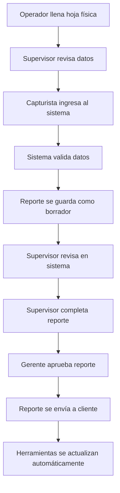
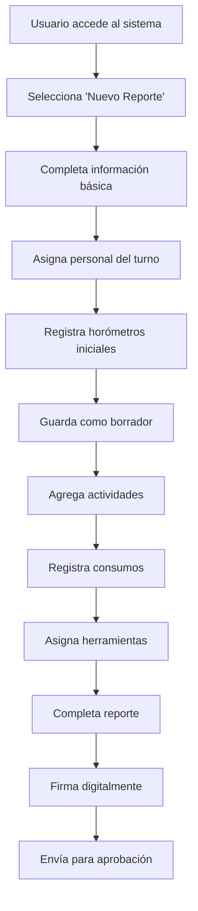
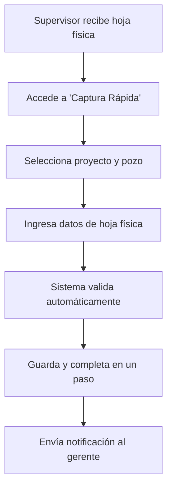
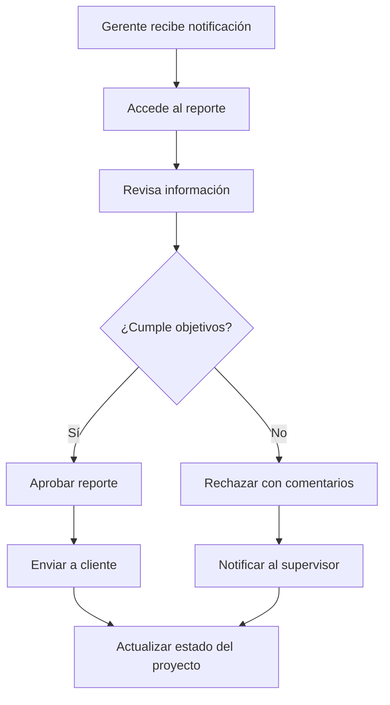
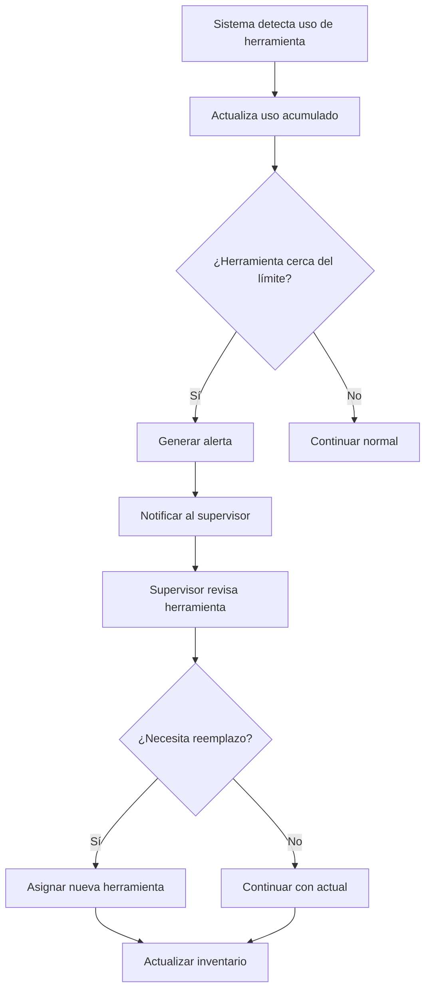

# Drilling Reports - Related Entities API

> **Documentación de APIs relacionadas para el módulo DrillingReports**
> 
> Este documento contiene todos los endpoints de las entidades relacionadas que el frontend necesita para implementar el módulo de Reportes de Perforación.

---

## 📋 **ÍNDICE**

1. [Projects API](#projects-api) - Gestión de proyectos de perforación
2. [Wells API](#wells-api) - Gestión de pozos
3. [Tools API](#tools-api) - Gestión de herramientas
4. [Documents API](#documents-api) - Gestión de documentos
5. [Ejemplos de Integración](#ejemplos-de-integración)

---

## 🏗️ **PROJECTS API**

### **Base URL:** `/api/drilling/projects`

### **Headers Requeridos:**
```http
Authorization: Bearer {token}
X-Company-Id: {company-uuid}
Content-Type: application/json
```

---

### **1. Listar Proyectos**

**Endpoint:** `GET /api/drilling/projects`

**Query Parameters:**
```
?page=1
&per_page=15
&project_name=Texas            # Filtro por nombre (coincidencia parcial)
&project_code=PROJ-2025        # Filtro por código (coincidencia parcial)
&client_id={uuid}              # Filtro por cliente
&status=active                 # Filtro por estado: planned, active, completed, suspended, cancelled
&general_location=Texas        # Filtro por ubicación (coincidencia parcial)
&min_budget=100000            # Filtro presupuesto mínimo
&max_budget=5000000           # Filtro presupuesto máximo
&start_date_from=2025-01-01   # Filtro rango fecha inicio
&start_date_to=2025-12-31
&over_budget=true             # Solo proyectos sobre presupuesto
&min_budget_utilization=80     # Mínimo % utilización presupuesto
&sort_by=project_code         # Campo ordenamiento: project_code, project_name, start_date, total_budget
&sort_order=desc              # Dirección ordenamiento: asc, desc
```

**Response:** `200 OK`
```json
{
  "data": [
    {
      "id": "uuid",
      "project_code": "PROJ-2025-001",
      "project_name": "Texas Oil Exploration",
      "client_id": "uuid",
      "client_name": "PetroCorp",
      "status": "active",
      "general_location": "Texas, USA",
      "total_budget": 5000000.00,
      "budget_utilization_percentage": 45.2,
      "start_date": "2025-01-15",
      "estimated_completion_date": "2025-12-31",
      "actual_completion_date": null,
      "created_at": "2025-01-10T10:00:00Z",
      "updated_at": "2025-01-15T14:30:00Z"
    }
  ],
  "meta": {
    "current_page": 1,
    "per_page": 15,
    "total": 25,
    "last_page": 2
  }
}
```

---

### **2. Crear Proyecto**

**Endpoint:** `POST /api/drilling/projects`

**Request Body:**
```json
{
  "project_name": "Nuevo Proyecto de Perforación",
  "client_id": "uuid",
  "general_location": "Texas, USA",
  "total_budget": 5000000.00,
  "start_date": "2025-03-01",
  "estimated_completion_date": "2025-12-31",
  "description": "Proyecto de exploración en Texas",
  "notes": "Notas adicionales del proyecto"
}
```

**Response:** `201 Created`
```json
{
  "success": true,
  "message": "Proyecto creado exitosamente",
  "data": {
    "id": "uuid",
    "project_code": "PROJ-2025-002",
    "project_name": "Nuevo Proyecto de Perforación",
    "status": "planned",
    "created_at": "2025-01-15T10:00:00Z"
  }
}
```

---

### **3. Ver Proyecto**

**Endpoint:** `GET /api/drilling/projects/{id}`

**Response:** `200 OK`
```json
{
  "data": {
    "id": "uuid",
    "project_code": "PROJ-2025-001",
    "project_name": "Texas Oil Exploration",
    "client_id": "uuid",
    "client_name": "PetroCorp",
    "status": "active",
    "general_location": "Texas, USA",
    "total_budget": 5000000.00,
    "budget_utilization_percentage": 45.2,
    "start_date": "2025-01-15",
    "estimated_completion_date": "2025-12-31",
    "actual_completion_date": null,
    "description": "Proyecto de exploración en Texas",
    "notes": "Notas del proyecto",
    "personnel": [
      {
        "employee_id": "uuid",
        "employee_name": "Juan Pérez",
        "role": "supervisor",
        "assigned_at": "2025-01-15T10:00:00Z"
      }
    ],
    "wells": [
      {
        "id": "uuid",
        "well_number": "WELL-001",
        "well_name": "Discovery Well Alpha",
        "status": "drilling"
      }
    ],
    "created_at": "2025-01-10T10:00:00Z",
    "updated_at": "2025-01-15T14:30:00Z"
  }
}
```

---

### **4. Actualizar Proyecto**

**Endpoint:** `PUT /api/drilling/projects/{id}`

**Request Body:**
```json
{
  "project_name": "Texas Oil Exploration - Actualizado",
  "general_location": "Texas, USA - Norte",
  "total_budget": 6000000.00,
  "estimated_completion_date": "2025-11-30",
  "description": "Proyecto actualizado",
  "notes": "Notas actualizadas"
}
```

---

### **5. Gestión de Estado del Proyecto**

#### **Iniciar Proyecto**
**Endpoint:** `POST /api/drilling/projects/{id}/start`

#### **Completar Proyecto**
**Endpoint:** `POST /api/drilling/projects/{id}/complete`

#### **Suspender Proyecto**
**Endpoint:** `POST /api/drilling/projects/{id}/suspend`

#### **Cancelar Proyecto**
**Endpoint:** `POST /api/drilling/projects/{id}/cancel`

#### **Reanudar Proyecto**
**Endpoint:** `POST /api/drilling/projects/{id}/resume`

---

### **6. Gestión de Personal**

#### **Asignar Personal**
**Endpoint:** `POST /api/drilling/projects/{id}/personnel`

**Request Body:**
```json
{
  "employee_id": "uuid",
  "role": "supervisor"  // supervisor, operator, helper, engineer
}
```

#### **Quitar Personal**
**Endpoint:** `DELETE /api/drilling/projects/{id}/personnel/{employeeId}`

#### **Ver Personal del Proyecto**
**Endpoint:** `GET /api/drilling/projects/{id}/personnel`

---

### **7. Gestión de Costos**

#### **Agregar Costo**
**Endpoint:** `POST /api/drilling/projects/{id}/costs`

**Request Body:**
```json
{
  "cost_type": "equipment",  // equipment, personnel, materials, other
  "description": "Compra de brocas",
  "amount": 15000.00,
  "currency": "USD",
  "cost_date": "2025-01-15"
}
```

#### **Ver Costos del Proyecto**
**Endpoint:** `GET /api/drilling/projects/{id}/costs`

#### **Actualizar Presupuesto**
**Endpoint:** `PUT /api/drilling/projects/{id}/budget`

**Request Body:**
```json
{
  "total_budget": 6000000.00
}
```

---

### **8. Gestión de Pozos**

#### **Agregar Pozo al Proyecto**
**Endpoint:** `POST /api/drilling/projects/{id}/wells`

#### **Quitar Pozo del Proyecto**
**Endpoint:** `DELETE /api/drilling/projects/{id}/wells/{wellId}`

#### **Ver Pozos del Proyecto**
**Endpoint:** `GET /api/drilling/projects/{id}/wells`

---

### **9. Historial de Cambios**

**Endpoint:** `GET /api/drilling/projects/{id}/status-history`

**Response:** `200 OK`
```json
{
  "data": [
    {
      "id": "uuid",
      "previous_status": "planned",
      "new_status": "active",
      "change_date": "2025-01-15T10:00:00Z",
      "reason": "Proyecto iniciado",
      "changed_by": "uuid",
      "changed_by_name": "Juan Pérez"
    }
  ]
}
```

---

## 🕳️ **WELLS API**

### **Base URL:** `/api/drilling/projects/{projectId}/wells`

---

### **1. Listar Pozos del Proyecto**

**Endpoint:** `GET /api/drilling/projects/{projectId}/wells`

**Query Parameters:**
```
?page=1
&per_page=15
&well_number=WELL-001        # Filtro por número de pozo
&well_name=Discovery         # Filtro por nombre (coincidencia parcial)
&well_type=exploration       # Filtro por tipo: exploration, development, appraisal, injection, observation
&status=drilling            # Filtro por estado: planned, drilling, completed, suspended, abandoned
&min_depth=1000             # Filtro profundidad mínima
&max_depth=5000             # Filtro profundidad máxima
&spud_date_from=2025-01-01  # Filtro rango fecha spud
&spud_date_to=2025-12-31
&sort_by=well_number        # Campo ordenamiento: well_number, well_name, spud_date, current_depth
&sort_order=asc             # Dirección ordenamiento: asc, desc
```

**Response:** `200 OK`
```json
{
  "data": [
    {
      "id": "uuid",
      "well_number": "WELL-001",
      "well_name": "Discovery Well Alpha",
      "well_type": "exploration",
      "coordinates": {
        "latitude": 29.7604,
        "longitude": -95.3698
      },
      "planned_depth": 3000.0,
      "current_depth": 1250.5,
      "depth_unit": "meters",
      "status": "drilling",
      "spud_date": "2025-03-01",
      "estimated_completion_date": "2025-06-30",
      "actual_completion_date": null,
      "notes": "Pozo principal de exploración",
      "created_at": "2025-02-15T10:00:00Z",
      "updated_at": "2025-03-01T08:00:00Z"
    }
  ],
  "meta": {
    "current_page": 1,
    "per_page": 15,
    "total": 5,
    "last_page": 1
  }
}
```

---

### **2. Crear Pozo**

**Endpoint:** `POST /api/drilling/projects/{projectId}/wells`

**Request Body:**
```json
{
  "well_number": "WELL-002",
  "well_name": "Discovery Well Beta",
  "well_type": "exploration",
  "coordinates": {
    "latitude": 29.7604,
    "longitude": -95.3698
  },
  "planned_depth": 3500.0,
  "depth_unit": "meters",
  "spud_date": "2025-04-01",
  "estimated_completion_date": "2025-07-31",
  "notes": "Segundo pozo de exploración"
}
```

**Response:** `201 Created`
```json
{
  "success": true,
  "message": "Pozo creado exitosamente",
  "data": {
    "id": "uuid",
    "well_number": "WELL-002",
    "well_name": "Discovery Well Beta",
    "status": "planned",
    "created_at": "2025-01-15T10:00:00Z"
  }
}
```

---

### **3. Ver Pozo**

**Endpoint:** `GET /api/drilling/projects/{projectId}/wells/{id}`

**Response:** `200 OK`
```json
{
  "data": {
    "id": "uuid",
    "well_number": "WELL-001",
    "well_name": "Discovery Well Alpha",
    "well_type": "exploration",
    "coordinates": {
      "latitude": 29.7604,
      "longitude": -95.3698
    },
    "planned_depth": 3000.0,
    "current_depth": 1250.5,
    "depth_unit": "meters",
    "status": "drilling",
    "spud_date": "2025-03-01",
    "estimated_completion_date": "2025-06-30",
    "actual_completion_date": null,
    "notes": "Pozo principal de exploración",
    "sections": [
      {
        "id": "uuid",
        "section_name": "Sección 1",
        "start_depth": 0.0,
        "end_depth": 500.0,
        "diameter": 12.25,
        "casing_type": "surface"
      }
    ],
    "lithology_logs": [
      {
        "id": "uuid",
        "depth_from": 0.0,
        "depth_to": 100.0,
        "formation": "Sandstone",
        "description": "Arena fina con intercalaciones de lutita"
      }
    ],
    "equipment_usage": [
      {
        "id": "uuid",
        "equipment_type": "drill_bit",
        "equipment_id": "uuid",
        "start_time": "2025-03-01T08:00:00Z",
        "end_time": "2025-03-01T16:00:00Z",
        "hours_used": 8.0
      }
    ],
    "created_at": "2025-02-15T10:00:00Z",
    "updated_at": "2025-03-01T08:00:00Z"
  }
}
```

---

### **4. Actualizar Pozo**

**Endpoint:** `PUT /api/drilling/projects/{projectId}/wells/{id}`

**Request Body:**
```json
{
  "well_name": "Discovery Well Alpha - Actualizado",
  "planned_depth": 3200.0,
  "estimated_completion_date": "2025-07-15",
  "notes": "Notas actualizadas del pozo"
}
```

---

### **5. Operaciones de Perforación**

#### **Iniciar Perforación**
**Endpoint:** `POST /api/drilling/projects/{projectId}/wells/{id}/start`

#### **Completar Pozo**
**Endpoint:** `POST /api/drilling/projects/{projectId}/wells/{id}/complete`

#### **Suspender Perforación**
**Endpoint:** `POST /api/drilling/projects/{projectId}/wells/{id}/suspend`

#### **Abandonar Pozo**
**Endpoint:** `POST /api/drilling/projects/{projectId}/wells/{id}/abandon`

#### **Reanudar Perforación**
**Endpoint:** `POST /api/drilling/projects/{projectId}/wells/{id}/resume`

#### **Actualizar Profundidad**
**Endpoint:** `PUT /api/drilling/projects/{projectId}/wells/{id}/depth`

**Request Body:**
```json
{
  "current_depth": 1350.0,
  "depth_unit": "meters"
}
```

---

### **6. Secciones de Perforación**

#### **Agregar Sección**
**Endpoint:** `POST /api/drilling/projects/{projectId}/wells/{id}/sections`

**Request Body:**
```json
{
  "section_name": "Sección 2",
  "start_depth": 500.0,
  "end_depth": 1000.0,
  "diameter": 9.625,
  "casing_type": "intermediate",
  "cement_type": "class_g",
  "notes": "Sección intermedia"
}
```

#### **Ver Secciones**
**Endpoint:** `GET /api/drilling/projects/{projectId}/wells/{id}/sections`

---

### **7. Logs Litológicos**

#### **Agregar Log Litológico**
**Endpoint:** `POST /api/drilling/projects/{projectId}/wells/{id}/lithology`

**Request Body:**
```json
{
  "depth_from": 100.0,
  "depth_to": 150.0,
  "formation": "Sandstone",
  "lithology": "Fine-grained sandstone",
  "description": "Arena fina con intercalaciones de lutita",
  "porosity": 15.5,
  "permeability": 120.0,
  "notes": "Formación con buena porosidad"
}
```

#### **Ver Logs Litológicos**
**Endpoint:** `GET /api/drilling/projects/{projectId}/wells/{id}/lithology`

---

### **8. Uso de Equipo**

#### **Registrar Uso de Equipo**
**Endpoint:** `POST /api/drilling/projects/{projectId}/wells/{id}/equipment-usage`

**Request Body:**
```json
{
  "equipment_type": "drill_bit",
  "equipment_id": "uuid",
  "start_time": "2025-03-01T08:00:00Z",
  "end_time": "2025-03-01T16:00:00Z",
  "hours_used": 8.0,
  "notes": "Uso normal de la broca"
}
```

#### **Ver Uso de Equipo**
**Endpoint:** `GET /api/drilling/projects/{projectId}/wells/{id}/equipment-usage`

---

## 🔧 **TOOLS API**

### **Base URL:** `/api/drilling/tools`

---

### **1. Listar Herramientas**

**Endpoint:** `GET /api/drilling/tools`

**Query Parameters:**
```
?page=1
&per_page=15
&tool_name=Broca 12"           # Filtro por nombre (coincidencia parcial)
&tool_code=BR-12-001           # Filtro por código (coincidencia parcial)
&tool_type=drill_bit          # Filtro por tipo: drill_bit, casing, pipe, accessory
&tool_category=drill_bit      # Filtro por categoría: drill_bit, casing, pipe, accessory
&status=available             # Filtro por estado: available, in_use, maintenance, damaged, lost, retired
&manufacturer=Atlas           # Filtro por fabricante (coincidencia parcial)
&min_capacity=1000           # Filtro capacidad mínima
&max_capacity=5000            # Filtro capacidad máxima
&sort_by=tool_code            # Campo ordenamiento: tool_code, tool_name, manufacturer, capacity
&sort_order=asc               # Dirección ordenamiento: asc, desc
```

**Response:** `200 OK`
```json
{
  "data": [
    {
      "id": "uuid",
      "tool_code": "BR-12-001",
      "tool_name": "Broca 12 pulgadas",
      "tool_type": "drill_bit",
      "tool_category": "drill_bit",
      "manufacturer": "Atlas Copco",
      "model": "ABC-123",
      "serial_number": "SN123456",
      "capacity": {
        "meters": 1000.0,
        "unit": "meters"
      },
      "total_usage": {
        "meters": 250.5,
        "unit": "meters"
      },
      "remaining_capacity": {
        "meters": 749.5,
        "unit": "meters"
      },
      "status": "available",
      "purchase_date": "2024-01-15",
      "last_maintenance_date": "2024-12-01",
      "next_maintenance_date": "2025-03-01",
      "notes": "Broca en excelente estado",
      "created_at": "2024-01-15T10:00:00Z",
      "updated_at": "2024-12-01T14:30:00Z"
    }
  ],
  "meta": {
    "current_page": 1,
    "per_page": 15,
    "total": 50,
    "last_page": 4
  }
}
```

---

### **2. Crear Herramienta**

**Endpoint:** `POST /api/drilling/tools`

**Request Body:**
```json
{
  "tool_name": "Broca 12 pulgadas",
  "tool_type": "drill_bit",
  "tool_category": "drill_bit",
  "manufacturer": "Atlas Copco",
  "model": "ABC-123",
  "serial_number": "SN123456",
  "capacity": {
    "meters": 1000.0,
    "unit": "meters"
  },
  "purchase_date": "2024-01-15",
  "purchase_price": 15000.00,
  "currency": "USD",
  "notes": "Broca nueva para perforación"
}
```

**Response:** `201 Created`
```json
{
  "success": true,
  "message": "Herramienta creada exitosamente",
  "data": {
    "id": "uuid",
    "tool_code": "BR-12-002",
    "tool_name": "Broca 12 pulgadas",
    "status": "available",
    "created_at": "2025-01-15T10:00:00Z"
  }
}
```

---

### **3. Ver Herramienta**

**Endpoint:** `GET /api/drilling/tools/{id}`

**Response:** `200 OK`
```json
{
  "data": {
    "id": "uuid",
    "tool_code": "BR-12-001",
    "tool_name": "Broca 12 pulgadas",
    "tool_type": "drill_bit",
    "tool_category": "drill_bit",
    "manufacturer": "Atlas Copco",
    "model": "ABC-123",
    "serial_number": "SN123456",
    "capacity": {
      "meters": 1000.0,
      "unit": "meters"
    },
    "total_usage": {
      "meters": 250.5,
      "unit": "meters"
    },
    "remaining_capacity": {
      "meters": 749.5,
      "unit": "meters"
    },
    "status": "available",
    "purchase_date": "2024-01-15",
    "purchase_price": 15000.00,
    "currency": "USD",
    "last_maintenance_date": "2024-12-01",
    "next_maintenance_date": "2025-03-01",
    "usage_history": [
      {
        "id": "uuid",
        "report_id": "uuid",
        "report_number": "RPT-2025-001",
        "start_depth": 0.0,
        "end_depth": 250.5,
        "meters_used": 250.5,
        "usage_date": "2025-01-15T10:00:00Z"
      }
    ],
    "maintenance_history": [
      {
        "id": "uuid",
        "maintenance_type": "preventive",
        "description": "Mantenimiento preventivo programado",
        "maintenance_date": "2024-12-01T10:00:00Z",
        "cost": 500.00,
        "currency": "USD"
      }
    ],
    "notes": "Broca en excelente estado",
    "created_at": "2024-01-15T10:00:00Z",
    "updated_at": "2024-12-01T14:30:00Z"
  }
}
```

---

### **4. Actualizar Herramienta**

**Endpoint:** `PUT /api/drilling/tools/{id}`

**Request Body:**
```json
{
  "tool_name": "Broca 12 pulgadas - Actualizada",
  "manufacturer": "Atlas Copco",
  "model": "ABC-123",
  "serial_number": "SN123456",
  "capacity": {
    "meters": 1200.0,
    "unit": "meters"
  },
  "notes": "Capacidad actualizada"
}
```

---

### **5. Gestión de Herramientas**

#### **Asignar Herramienta**
**Endpoint:** `POST /api/drilling/tools/{id}/assign`

**Request Body:**
```json
{
  "project_id": "uuid",
  "well_id": "uuid",
  "assigned_by": "uuid",
  "notes": "Asignada para perforación"
}
```

#### **Devolver Herramienta**
**Endpoint:** `POST /api/drilling/tools/{id}/return`

**Request Body:**
```json
{
  "returned_by": "uuid",
  "condition": "good",  // good, fair, poor
  "notes": "Herramienta devuelta en buen estado"
}
```

#### **Enviar a Mantenimiento**
**Endpoint:** `POST /api/drilling/tools/{id}/maintenance`

**Request Body:**
```json
{
  "maintenance_type": "preventive",  // preventive, corrective, emergency
  "description": "Mantenimiento preventivo programado",
  "scheduled_date": "2025-03-01",
  "estimated_cost": 500.00,
  "currency": "USD",
  "notes": "Mantenimiento programado"
}
```

#### **Completar Mantenimiento**
**Endpoint:** `POST /api/drilling/tools/{id}/maintenance/complete`

**Request Body:**
```json
{
  "actual_cost": 450.00,
  "currency": "USD",
  "maintenance_notes": "Mantenimiento completado exitosamente",
  "condition_after": "excellent"  // excellent, good, fair, poor
}
```

#### **Reportar Daño**
**Endpoint:** `POST /api/drilling/tools/{id}/damage`

**Request Body:**
```json
{
  "damage_type": "wear",  // wear, crack, break, other
  "description": "Desgaste excesivo en los dientes",
  "severity": "moderate",  // minor, moderate, severe
  "reported_by": "uuid",
  "notes": "Daño reportado durante inspección"
}
```

#### **Reportar Pérdida**
**Endpoint:** `POST /api/drilling/tools/{id}/lost`

**Request Body:**
```json
{
  "lost_date": "2025-01-15",
  "lost_location": "Pozo WELL-001",
  "lost_reason": "theft",  // theft, accident, misplacement, other
  "reported_by": "uuid",
  "notes": "Herramienta perdida durante operación"
}
```

#### **Retirar Herramienta**
**Endpoint:** `POST /api/drilling/tools/{id}/retire`

**Request Body:**
```json
{
  "retirement_reason": "end_of_life",  // end_of_life, damaged, obsolete, other
  "retirement_date": "2025-01-15",
  "disposal_method": "recycle",  // recycle, dispose, sell, other
  "notes": "Herramienta retirada por fin de vida útil"
}
```

---

### **6. Consultas por Estado**

#### **Herramientas Disponibles**
**Endpoint:** `GET /api/drilling/tools/status/available`

#### **Herramientas en Uso**
**Endpoint:** `GET /api/drilling/tools/status/in-use`

#### **Herramientas que Necesitan Mantenimiento**
**Endpoint:** `GET /api/drilling/tools/maintenance/needed`

---

## 📄 **DOCUMENTS API**

> **Nota:** Los documentos se manejan a través del módulo general de documentos o como adjuntos a los reportes de perforación.

### **Base URL:** `/api/documents` (Módulo general)

---

### **1. Subir Documento**

**Endpoint:** `POST /api/documents`

**Request Body (multipart/form-data):**
```
file: [archivo]
title: "Reporte de Perforación - RPT-2025-001"
description: "Reporte diario de perforación"
category: "drilling_report"
related_entity_type: "drilling_report"
related_entity_id: "uuid"
```

**Response:** `201 Created`
```json
{
  "success": true,
  "message": "Documento subido exitosamente",
  "data": {
    "id": "uuid",
    "title": "Reporte de Perforación - RPT-2025-001",
    "file_name": "reporte_perforacion_001.pdf",
    "file_size": 1024000,
    "mime_type": "application/pdf",
    "url": "/storage/documents/uuid/reporte_perforacion_001.pdf",
    "created_at": "2025-01-15T10:00:00Z"
  }
}
```

---

### **2. Listar Documentos**

**Endpoint:** `GET /api/documents`

**Query Parameters:**
```
?page=1
&per_page=15
&category=drilling_report    # Filtro por categoría
&related_entity_type=drilling_report  # Filtro por tipo de entidad relacionada
&related_entity_id=uuid      # Filtro por ID de entidad relacionada
&title=Reporte              # Filtro por título (coincidencia parcial)
&sort_by=created_at         # Campo ordenamiento: created_at, title, file_size
&sort_order=desc            # Dirección ordenamiento: asc, desc
```

---

### **3. Ver Documento**

**Endpoint:** `GET /api/documents/{id}`

---

### **4. Descargar Documento**

**Endpoint:** `GET /api/documents/{id}/download`

---

### **5. Eliminar Documento**

**Endpoint:** `DELETE /api/documents/{id}`

---

## 🔗 **EJEMPLOS DE INTEGRACIÓN**

### **Flujo Completo: Crear Reporte con Entidades Relacionadas**

```javascript
// 1. Obtener proyectos disponibles
const projects = await api.get('/drilling/projects?status=active');

// 2. Obtener pozos del proyecto seleccionado
const wells = await api.get(`/drilling/projects/${projectId}/wells?status=drilling`);

// 3. Obtener herramientas disponibles
const tools = await api.get('/drilling/tools?status=available&tool_type=drill_bit');

// 4. Crear reporte de perforación
const report = await api.post('/drilling/reports', {
  project_id: projectId,
  well_id: wellId,
  report_date: '2025-01-15',
  shift: 'day'
});

// 5. Agregar actividades
await api.post(`/drilling/reports/${reportId}/activities`, {
  activity_type: 'drilling',
  shift: 'day',
  hours: 8.0,
  start_time: '08:00:00',
  end_time: '16:00:00',
  description: 'Perforación continua'
});

// 6. Asignar herramientas
await api.post(`/drilling/reports/${reportId}/tools`, {
  tool_id: toolId,
  shift: 'day',
  tool_category: 'drill_bit',
  start_depth_meters: 0.0,
  end_depth_meters: 45.3,
  wear_pattern: 'uniform',
  matrix: 'good_condition'
});

// 7. Subir documento adjunto
const document = await api.post('/documents', formData, {
  headers: { 'Content-Type': 'multipart/form-data' }
});

// 8. Completar reporte
await api.post(`/drilling/reports/${reportId}/complete`);
```

---

## 📋 **RESUMEN DE ENDPOINTS**

### **Projects (17 endpoints)**
- CRUD básico: 5 endpoints
- Gestión de estado: 5 endpoints
- Gestión de personal: 3 endpoints
- Gestión de costos: 3 endpoints
- Gestión de pozos: 3 endpoints
- Historial: 1 endpoint

### **Wells (15 endpoints)**
- CRUD básico: 5 endpoints
- Operaciones de perforación: 6 endpoints
- Secciones: 2 endpoints
- Litología: 2 endpoints
- Uso de equipo: 2 endpoints

### **Tools (13 endpoints)**
- CRUD básico: 5 endpoints
- Gestión de herramientas: 8 endpoints

### **Documents (5 endpoints)**
- CRUD básico: 5 endpoints

**Total: 50 endpoints relacionados** 🎯

---

## ✅ **CONCLUSIÓN**

Esta documentación proporciona **TODOS los endpoints necesarios** para que el frontend pueda:

1. ✅ **Seleccionar proyectos** al crear reportes
2. ✅ **Seleccionar pozos** al crear reportes
3. ✅ **Asignar herramientas** a los reportes
4. ✅ **Adjuntar documentos** a los reportes
5. ✅ **Gestionar el flujo completo** de reportes de perforación

**¡Ahora el equipo de frontend tiene TODO lo necesario!** 🚀

# Drilling Reports - Especificación Técnica de Entidades

> **Especificación técnica completa de todas las entidades del módulo DrillingReports**
> 
> Este documento contiene la estructura de datos, validaciones, tipos y relaciones de todas las entidades necesarias para el frontend.

---

## 📋 **ÍNDICE**

1. [DrillingReport Entity](#drillingreport-entity) - Entidad principal
2. [Project Entity](#project-entity) - Proyectos de perforación
3. [Well Entity](#well-entity) - Pozos
4. [Tool Entity](#tool-entity) - Herramientas
5. [Employee Entity](#employee-entity) - Empleados
6. [Document Entity](#document-entity) - Documentos
7. [Value Objects](#value-objects) - Objetos de valor
8. [Enums y Constantes](#enums-y-constantes) - Valores predefinidos
9. [Relaciones entre Entidades](#relaciones-entre-entidades) - Mapeo de relaciones
10. [Validaciones Frontend](#validaciones-frontend) - Reglas de validación

---

## 📊 **DRILLINGREPORT ENTITY**

### **Estructura de Datos**

```typescript
interface DrillingReport {
  // Identificadores
  id: string;                    // UUID
  report_number: string;          // Formato: RPT-YYYY-NNNN
  company_id: string;             // UUID
  
  // Relaciones principales
  project_id: string;            // UUID - Obligatorio
  well_id: string;                 // UUID - Obligatorio
  
  // Información básica
  report_date: string;           // ISO 8601 date (YYYY-MM-DD)
  shift: 'day' | 'night';        // Enum - Obligatorio
  
  // Personal
  operator_day_id?: string;      // UUID - Opcional
  operator_night_id?: string;    // UUID - Opcional
  helper1_day_id?: string;       // UUID - Opcional
  helper1_night_id?: string;     // UUID - Opcional
  helper2_day_id?: string;       // UUID - Opcional
  helper2_night_id?: string;     // UUID - Opcional
  supervisor_id?: string;        // UUID - Opcional
  
  // Horómetros
  horometer_start_day?: number;  // Decimal(10,2) - Opcional
  horometer_end_day?: number;    // Decimal(10,2) - Opcional
  horometer_start_night?: number; // Decimal(10,2) - Opcional
  horometer_end_night?: number;   // Decimal(10,2) - Opcional
  
  // Parámetros de perforación
  rpm_pull_down?: number;        // Decimal(8,2) - Opcional
  rpm_rotation?: number;         // Decimal(8,2) - Opcional
  weight_on_bit?: number;        // Decimal(10,2) - Opcional
  flow_rate?: number;           // Decimal(8,2) - Opcional
  
  // Observaciones
  observations?: string;         // Text - Opcional (max 1000 chars)
  
  // Estado
  status: 'draft' | 'completed' | 'approved' | 'rejected'; // Enum - Obligatorio
  
  // Metadatos
  created_at: string;            // ISO 8601 datetime
  updated_at: string;            // ISO 8601 datetime
  created_by: string;            // UUID
  updated_by?: string;           // UUID - Opcional
  
  // Colecciones relacionadas
  activities: DrillingActivity[];     // Array de actividades
  consumptions: DrillingConsumption[]; // Array de consumos
  tool_assignments: DrillingToolAssignment[]; // Array de herramientas
  casings: DrillingCasing[];          // Array de revestimientos
  additives: DrillingAdditive[];      // Array de aditivos
  accessories: DrillingAccessory[];   // Array de accesorios
  signatures: DrillingSignature[];    // Array de firmas
}
```

### **Validaciones**

```typescript
const DrillingReportValidation = {
  // Campos obligatorios
  required: ['project_id', 'well_id', 'report_date', 'shift', 'status'],
  
  // Validaciones específicas
  report_date: {
    type: 'date',
    format: 'YYYY-MM-DD',
    min: '2020-01-01',
    max: '2030-12-31'
  },
  
  shift: {
    type: 'enum',
    values: ['day', 'night']
  },
  
  status: {
    type: 'enum',
    values: ['draft', 'completed', 'approved', 'rejected']
  },
  
  horometer_start_day: {
    type: 'decimal',
    min: 0,
    max: 999999.99,
    precision: 2
  },
  
  horometer_end_day: {
    type: 'decimal',
    min: 0,
    max: 999999.99,
    precision: 2,
    // Debe ser mayor que horometer_start_day
    custom: 'end_horometer > start_horometer'
  },
  
  rpm_pull_down: {
    type: 'decimal',
    min: 0,
    max: 999.99,
    precision: 2
  },
  
  rpm_rotation: {
    type: 'decimal',
    min: 0,
    max: 999.99,
    precision: 2
  },
  
  weight_on_bit: {
    type: 'decimal',
    min: 0,
    max: 999999.99,
    precision: 2
  },
  
  flow_rate: {
    type: 'decimal',
    min: 0,
    max: 999.99,
    precision: 2
  },
  
  observations: {
    type: 'string',
    maxLength: 1000
  }
};
```

---

## 🏗️ **PROJECT ENTITY**

### **Estructura de Datos**

```typescript
interface Project {
  // Identificadores
  id: string;                    // UUID
  project_code: string;          // Formato: PROJ-YYYY-NNNN
  company_id: string;           // UUID
  
  // Información básica
  project_name: string;          // String (max 255) - Obligatorio
  client_id: string;            // UUID - Obligatorio
  client_name: string;          // String (max 255) - Calculado
  
  // Estado
  status: 'planned' | 'active' | 'completed' | 'suspended' | 'cancelled'; // Enum - Obligatorio
  
  // Ubicación
  general_location: string;     // String (max 255) - Obligatorio
  
  // Presupuesto
  total_budget: number;         // Decimal(15,2) - Obligatorio
  budget_utilization_percentage: number; // Decimal(5,2) - Calculado
  
  // Fechas
  start_date?: string;          // ISO 8601 date - Opcional
  estimated_completion_date?: string; // ISO 8601 date - Opcional
  actual_completion_date?: string;    // ISO 8601 date - Opcional
  
  // Descripción
  description?: string;         // Text - Opcional (max 2000 chars)
  notes?: string;               // Text - Opcional (max 1000 chars)
  
  // Metadatos
  created_at: string;           // ISO 8601 datetime
  updated_at: string;           // ISO 8601 datetime
  created_by: string;           // UUID
  updated_by?: string;          // UUID - Opcional
  
  // Relaciones
  personnel: ProjectPersonnel[];    // Array de personal asignado
  wells: Well[];                   // Array de pozos
  costs: ProjectCost[];            // Array de costos
  status_history: ProjectStatusHistory[]; // Array de historial de estado
}
```

### **Validaciones**

```typescript
const ProjectValidation = {
  required: ['project_name', 'client_id', 'general_location', 'total_budget', 'status'],
  
  project_name: {
    type: 'string',
    minLength: 3,
    maxLength: 255
  },
  
  client_id: {
    type: 'uuid',
    required: true
  },
  
  general_location: {
    type: 'string',
    minLength: 3,
    maxLength: 255
  },
  
  total_budget: {
    type: 'decimal',
    min: 0,
    max: 999999999999.99,
    precision: 2
  },
  
  status: {
    type: 'enum',
    values: ['planned', 'active', 'completed', 'suspended', 'cancelled']
  },
  
  start_date: {
    type: 'date',
    format: 'YYYY-MM-DD',
    min: '2020-01-01',
    max: '2030-12-31'
  },
  
  estimated_completion_date: {
    type: 'date',
    format: 'YYYY-MM-DD',
    min: '2020-01-01',
    max: '2030-12-31',
    // Debe ser posterior a start_date
    custom: 'estimated_completion_date > start_date'
  },
  
  description: {
    type: 'string',
    maxLength: 2000
  },
  
  notes: {
    type: 'string',
    maxLength: 1000
  }
};
```

---

## 🕳️ **WELL ENTITY**

### **Estructura de Datos**

```typescript
interface Well {
  // Identificadores
  id: string;                    // UUID
  well_number: string;          // String (max 50) - Obligatorio
  company_id: string;          // UUID
  
  // Relaciones
  project_id: string;          // UUID - Obligatorio
  project_name: string;        // String (max 255) - Calculado
  
  // Información básica
  well_name: string;           // String (max 255) - Obligatorio
  well_type: 'exploration' | 'development' | 'appraisal' | 'injection' | 'observation'; // Enum - Obligatorio
  
  // Coordenadas
  coordinates: {
    latitude: number;           // Decimal(10,8) - Obligatorio
    longitude: number;          // Decimal(11,8) - Obligatorio
  };
  
  // Profundidad
  planned_depth: number;       // Decimal(10,2) - Obligatorio
  current_depth: number;        // Decimal(10,2) - Calculado
  depth_unit: 'meters' | 'feet'; // Enum - Obligatorio
  
  // Estado
  status: 'planned' | 'drilling' | 'completed' | 'suspended' | 'abandoned'; // Enum - Obligatorio
  
  // Fechas
  spud_date?: string;          // ISO 8601 date - Opcional
  estimated_completion_date?: string; // ISO 8601 date - Opcional
  actual_completion_date?: string;    // ISO 8601 date - Opcional
  
  // Descripción
  notes?: string;              // Text - Opcional (max 1000 chars)
  
  // Metadatos
  created_at: string;           // ISO 8601 datetime
  updated_at: string;           // ISO 8601 datetime
  created_by: string;           // UUID
  updated_by?: string;          // UUID - Opcional
  
  // Relaciones
  sections: WellSection[];          // Array de secciones
  lithology_logs: LithologyLog[];  // Array de logs litológicos
  equipment_usage: EquipmentUsage[]; // Array de uso de equipo
  drilling_reports: DrillingReport[]; // Array de reportes de perforación
}
```

### **Validaciones**

```typescript
const WellValidation = {
  required: ['well_number', 'well_name', 'well_type', 'project_id', 'planned_depth', 'depth_unit', 'status'],
  
  well_number: {
    type: 'string',
    minLength: 3,
    maxLength: 50,
    pattern: '^[A-Z0-9-_]+$' // Solo mayúsculas, números, guiones y guiones bajos
  },
  
  well_name: {
    type: 'string',
    minLength: 3,
    maxLength: 255
  },
  
  well_type: {
    type: 'enum',
    values: ['exploration', 'development', 'appraisal', 'injection', 'observation']
  },
  
  coordinates: {
    latitude: {
      type: 'decimal',
      min: -90,
      max: 90,
      precision: 8
    },
    longitude: {
      type: 'decimal',
      min: -180,
      max: 180,
      precision: 8
    }
  },
  
  planned_depth: {
    type: 'decimal',
    min: 0,
    max: 999999.99,
    precision: 2
  },
  
  current_depth: {
    type: 'decimal',
    min: 0,
    max: 999999.99,
    precision: 2,
    // No puede ser mayor que planned_depth
    custom: 'current_depth <= planned_depth'
  },
  
  depth_unit: {
    type: 'enum',
    values: ['meters', 'feet']
  },
  
  status: {
    type: 'enum',
    values: ['planned', 'drilling', 'completed', 'suspended', 'abandoned']
  },
  
  spud_date: {
    type: 'date',
    format: 'YYYY-MM-DD',
    min: '2020-01-01',
    max: '2030-12-31'
  },
  
  estimated_completion_date: {
    type: 'date',
    format: 'YYYY-MM-DD',
    min: '2020-01-01',
    max: '2030-12-31',
    // Debe ser posterior a spud_date
    custom: 'estimated_completion_date > spud_date'
  },
  
  notes: {
    type: 'string',
    maxLength: 1000
  }
};
```

---

## 🔧 **TOOL ENTITY**

### **Estructura de Datos**

```typescript
interface Tool {
  // Identificadores
  id: string;                    // UUID
  tool_code: string;            // Formato: BR-12-001
  company_id: string;           // UUID
  
  // Información básica
  tool_name: string;            // String (max 255) - Obligatorio
  tool_type: 'drill_bit' | 'casing' | 'pipe' | 'accessory'; // Enum - Obligatorio
  tool_category: 'drill_bit' | 'casing' | 'pipe' | 'accessory'; // Enum - Obligatorio
  
  // Fabricante
  manufacturer: string;          // String (max 255) - Obligatorio
  model: string;                 // String (max 255) - Obligatorio
  serial_number: string;         // String (max 255) - Obligatorio
  
  // Capacidad y uso
  capacity: {
    meters: number;              // Decimal(10,2) - Obligatorio
    unit: 'meters' | 'feet';     // Enum - Obligatorio
  };
  
  total_usage: {
    meters: number;              // Decimal(10,2) - Calculado
    unit: 'meters' | 'feet';     // Enum - Calculado
  };
  
  remaining_capacity: {
    meters: number;              // Decimal(10,2) - Calculado
    unit: 'meters' | 'feet';     // Enum - Calculado
  };
  
  // Estado
  status: 'available' | 'in_use' | 'maintenance' | 'damaged' | 'lost' | 'retired'; // Enum - Obligatorio
  
  // Fechas
  purchase_date: string;         // ISO 8601 date - Obligatorio
  last_maintenance_date?: string; // ISO 8601 date - Opcional
  next_maintenance_date?: string; // ISO 8601 date - Opcional
  
  // Precio
  purchase_price?: number;       // Decimal(15,2) - Opcional
  currency?: 'USD' | 'MXN' | 'EUR'; // Enum - Opcional
  
  // Descripción
  notes?: string;                // Text - Opcional (max 1000 chars)
  
  // Metadatos
  created_at: string;            // ISO 8601 datetime
  updated_at: string;            // ISO 8601 datetime
  created_by: string;            // UUID
  updated_by?: string;          // UUID - Opcional
  
  // Relaciones
  usage_history: ToolUsageHistory[];     // Array de historial de uso
  maintenance_history: ToolMaintenance[]; // Array de historial de mantenimiento
  assignments: ToolAssignment[];         // Array de asignaciones
}
```

### **Validaciones**

```typescript
const ToolValidation = {
  required: ['tool_name', 'tool_type', 'tool_category', 'manufacturer', 'model', 'serial_number', 'capacity', 'purchase_date', 'status'],
  
  tool_name: {
    type: 'string',
    minLength: 3,
    maxLength: 255
  },
  
  tool_type: {
    type: 'enum',
    values: ['drill_bit', 'casing', 'pipe', 'accessory']
  },
  
  tool_category: {
    type: 'enum',
    values: ['drill_bit', 'casing', 'pipe', 'accessory']
  },
  
  manufacturer: {
    type: 'string',
    minLength: 2,
    maxLength: 255
  },
  
  model: {
    type: 'string',
    minLength: 2,
    maxLength: 255
  },
  
  serial_number: {
    type: 'string',
    minLength: 3,
    maxLength: 255,
    pattern: '^[A-Z0-9-_]+$' // Solo mayúsculas, números, guiones y guiones bajos
  },
  
  capacity: {
    meters: {
      type: 'decimal',
      min: 0,
      max: 999999.99,
      precision: 2
    },
    unit: {
      type: 'enum',
      values: ['meters', 'feet']
    }
  },
  
  status: {
    type: 'enum',
    values: ['available', 'in_use', 'maintenance', 'damaged', 'lost', 'retired']
  },
  
  purchase_date: {
    type: 'date',
    format: 'YYYY-MM-DD',
    min: '2020-01-01',
    max: '2030-12-31'
  },
  
  purchase_price: {
    type: 'decimal',
    min: 0,
    max: 999999999999.99,
    precision: 2
  },
  
  currency: {
    type: 'enum',
    values: ['USD', 'MXN', 'EUR']
  },
  
  notes: {
    type: 'string',
    maxLength: 1000
  }
};
```

---

## 👥 **EMPLOYEE ENTITY**

### **Estructura de Datos**

```typescript
interface Employee {
  // Identificadores
  id: string;                    // UUID
  employee_code: string;        // Formato: EMP-YYYY-NNNN
  company_id: string;           // UUID
  
  // Información personal
  first_name: string;           // String (max 100) - Obligatorio
  last_name: string;            // String (max 100) - Obligatorio
  full_name: string;            // String (max 200) - Calculado
  
  // Información de contacto
  email: string;                // Email - Obligatorio
  phone?: string;               // String (max 20) - Opcional
  mobile?: string;              // String (max 20) - Opcional
  
  // Información laboral
  position: string;             // String (max 100) - Obligatorio
  department: string;           // String (max 100) - Obligatorio
  employee_type: 'full_time' | 'part_time' | 'contract' | 'consultant'; // Enum - Obligatorio
  
  // Estado
  status: 'active' | 'inactive' | 'suspended' | 'terminated'; // Enum - Obligatorio
  
  // Fechas
  hire_date: string;            // ISO 8601 date - Obligatorio
  termination_date?: string;     // ISO 8601 date - Opcional
  
  // Metadatos
  created_at: string;           // ISO 8601 datetime
  updated_at: string;           // ISO 8601 datetime
  created_by: string;           // UUID
  updated_by?: string;          // UUID - Opcional
}
```

### **Validaciones**

```typescript
const EmployeeValidation = {
  required: ['first_name', 'last_name', 'email', 'position', 'department', 'employee_type', 'hire_date', 'status'],
  
  first_name: {
    type: 'string',
    minLength: 2,
    maxLength: 100
  },
  
  last_name: {
    type: 'string',
    minLength: 2,
    maxLength: 100
  },
  
  email: {
    type: 'email',
    maxLength: 255
  },
  
  phone: {
    type: 'string',
    maxLength: 20,
    pattern: '^[+]?[0-9\\s\\-\\(\\)]+$' // Solo números, espacios, guiones, paréntesis y +
  },
  
  mobile: {
    type: 'string',
    maxLength: 20,
    pattern: '^[+]?[0-9\\s\\-\\(\\)]+$'
  },
  
  position: {
    type: 'string',
    minLength: 2,
    maxLength: 100
  },
  
  department: {
    type: 'string',
    minLength: 2,
    maxLength: 100
  },
  
  employee_type: {
    type: 'enum',
    values: ['full_time', 'part_time', 'contract', 'consultant']
  },
  
  status: {
    type: 'enum',
    values: ['active', 'inactive', 'suspended', 'terminated']
  },
  
  hire_date: {
    type: 'date',
    format: 'YYYY-MM-DD',
    min: '2020-01-01',
    max: '2030-12-31'
  },
  
  termination_date: {
    type: 'date',
    format: 'YYYY-MM-DD',
    min: '2020-01-01',
    max: '2030-12-31',
    // Debe ser posterior a hire_date
    custom: 'termination_date > hire_date'
  }
};
```

---

## 📄 **DOCUMENT ENTITY**

### **Estructura de Datos**

```typescript
interface Document {
  // Identificadores
  id: string;                    // UUID
  company_id: string;           // UUID
  
  // Información del archivo
  title: string;                // String (max 255) - Obligatorio
  file_name: string;            // String (max 255) - Obligatorio
  file_size: number;            // Integer - Obligatorio
  mime_type: string;            // String (max 100) - Obligatorio
  
  // Categorización
  category: 'drilling_report' | 'project_document' | 'well_document' | 'tool_document' | 'other'; // Enum - Obligatorio
  
  // Relaciones
  related_entity_type?: string; // String (max 100) - Opcional
  related_entity_id?: string;   // UUID - Opcional
  
  // Descripción
  description?: string;         // Text - Opcional (max 2000 chars)
  
  // URL de acceso
  url: string;                  // String (max 500) - Calculado
  
  // Metadatos
  created_at: string;           // ISO 8601 datetime
  updated_at: string;           // ISO 8601 datetime
  created_by: string;           // UUID
  updated_by?: string;          // UUID - Opcional
}
```

### **Validaciones**

```typescript
const DocumentValidation = {
  required: ['title', 'file_name', 'file_size', 'mime_type', 'category'],
  
  title: {
    type: 'string',
    minLength: 3,
    maxLength: 255
  },
  
  file_name: {
    type: 'string',
    minLength: 3,
    maxLength: 255,
    pattern: '^[^<>:"/\\\\|?*]+$' // No caracteres especiales de archivo
  },
  
  file_size: {
    type: 'integer',
    min: 1,
    max: 104857600 // 100MB máximo
  },
  
  mime_type: {
    type: 'string',
    maxLength: 100,
    pattern: '^[a-zA-Z0-9][a-zA-Z0-9!#$&\-\^_]*/[a-zA-Z0-9][a-zA-Z0-9!#$&\-\^_]*$' // Formato MIME válido
  },
  
  category: {
    type: 'enum',
    values: ['drilling_report', 'project_document', 'well_document', 'tool_document', 'other']
  },
  
  related_entity_type: {
    type: 'string',
    maxLength: 100
  },
  
  related_entity_id: {
    type: 'uuid'
  },
  
  description: {
    type: 'string',
    maxLength: 2000
  }
};
```

---

## 🎯 **VALUE OBJECTS**

### **DepthRange**

```typescript
interface DepthRange {
  start_depth: number;           // Decimal(10,2) - Obligatorio
  end_depth: number;            // Decimal(10,2) - Obligatorio
  unit: 'meters' | 'feet';      // Enum - Obligatorio
  
  // Validaciones
  start_depth: {
    type: 'decimal',
    min: 0,
    max: 999999.99,
    precision: 2
  },
  
  end_depth: {
    type: 'decimal',
    min: 0,
    max: 999999.99,
    precision: 2,
    custom: 'end_depth > start_depth'
  },
  
  unit: {
    type: 'enum',
    values: ['meters', 'feet']
  }
}
```

### **Money**

```typescript
interface Money {
  amount: number;                // Decimal(15,2) - Obligatorio
  currency: 'USD' | 'MXN' | 'EUR'; // Enum - Obligatorio
  
  // Validaciones
  amount: {
    type: 'decimal',
    min: 0,
    max: 999999999999.99,
    precision: 2
  },
  
  currency: {
    type: 'enum',
    values: ['USD', 'MXN', 'EUR']
  }
}
```

### **Coordinates**

```typescript
interface Coordinates {
  latitude: number;              // Decimal(10,8) - Obligatorio
  longitude: number;             // Decimal(11,8) - Obligatorio
  
  // Validaciones
  latitude: {
    type: 'decimal',
    min: -90,
    max: 90,
    precision: 8
  },
  
  longitude: {
    type: 'decimal',
    min: -180,
    max: 180,
    precision: 8
  }
}
```

---

## 📝 **ENUMS Y CONSTANTES**

### **Estados de Reporte**

```typescript
enum DrillingReportStatus {
  DRAFT = 'draft',
  COMPLETED = 'completed',
  APPROVED = 'approved',
  REJECTED = 'rejected'
}
```

### **Turnos**

```typescript
enum Shift {
  DAY = 'day',
  NIGHT = 'night'
}
```

### **Tipos de Actividad**

```typescript
enum ActivityType {
  DRILLING = 'drilling',
  MAINTENANCE = 'maintenance',
  TRIPPING = 'tripping',
  CEMENTING = 'cementing',
  TESTING = 'testing',
  OTHER = 'other'
}
```

### **Tipos de Consumo**

```typescript
enum ConsumableType {
  BENTONITE = 'bentonite',
  WATER = 'water',
  CEMENT = 'cement',
  ADDITIVE = 'additive',
  FUEL = 'fuel',
  OTHER = 'other'
}
```

### **Categorías de Herramientas**

```typescript
enum ToolCategory {
  DRILL_BIT = 'drill_bit',
  CASING = 'casing',
  PIPE = 'pipe',
  ACCESSORY = 'accessory'
}
```

### **Estados de Herramientas**

```typescript
enum ToolStatus {
  AVAILABLE = 'available',
  IN_USE = 'in_use',
  MAINTENANCE = 'maintenance',
  DAMAGED = 'damaged',
  LOST = 'lost',
  RETIRED = 'retired'
}
```

### **Tipos de Pozo**

```typescript
enum WellType {
  EXPLORATION = 'exploration',
  DEVELOPMENT = 'development',
  APPRAISAL = 'appraisal',
  INJECTION = 'injection',
  OBSERVATION = 'observation'
}
```

### **Estados de Proyecto**

```typescript
enum ProjectStatus {
  PLANNED = 'planned',
  ACTIVE = 'active',
  COMPLETED = 'completed',
  SUSPENDED = 'suspended',
  CANCELLED = 'cancelled'
}
```

---

## 🔗 **RELACIONES ENTRE ENTIDADES**

### **Mapeo de Relaciones**

```typescript
interface EntityRelations {
  // DrillingReport
  DrillingReport: {
    project: Project;                    // Many-to-One
    well: Well;                         // Many-to-One
    activities: DrillingActivity[];      // One-to-Many
    consumptions: DrillingConsumption[]; // One-to-Many
    tool_assignments: DrillingToolAssignment[]; // One-to-Many
    casings: DrillingCasing[];          // One-to-Many
    additives: DrillingAdditive[];      // One-to-Many
    accessories: DrillingAccessory[];   // One-to-Many
    signatures: DrillingSignature[];     // One-to-Many
    documents: Document[];               // One-to-Many
  };
  
  // Project
  Project: {
    client: Client;                     // Many-to-One
    wells: Well[];                      // One-to-Many
    personnel: ProjectPersonnel[];      // One-to-Many
    costs: ProjectCost[];               // One-to-Many
    status_history: ProjectStatusHistory[]; // One-to-Many
    drilling_reports: DrillingReport[]; // One-to-Many
  };
  
  // Well
  Well: {
    project: Project;                    // Many-to-One
    sections: WellSection[];             // One-to-Many
    lithology_logs: LithologyLog[];     // One-to-Many
    equipment_usage: EquipmentUsage[];   // One-to-Many
    drilling_reports: DrillingReport[]; // One-to-Many
  };
  
  // Tool
  Tool: {
    usage_history: ToolUsageHistory[];   // One-to-Many
    maintenance_history: ToolMaintenance[]; // One-to-Many
    assignments: ToolAssignment[];       // One-to-Many
    tool_assignments: DrillingToolAssignment[]; // One-to-Many
  };
  
  // Employee
  Employee: {
    project_assignments: ProjectPersonnel[]; // One-to-Many
    drilling_reports_created: DrillingReport[]; // One-to-Many
    drilling_reports_updated: DrillingReport[]; // One-to-Many
  };
  
  // Document
  Document: {
    drilling_report: DrillingReport;    // Many-to-One
    project: Project;                   // Many-to-One
    well: Well;                         // Many-to-One
    tool: Tool;                         // Many-to-One
  };
}
```

---

## ✅ **VALIDACIONES FRONTEND**

### **Validaciones Generales**

```typescript
const FrontendValidations = {
  // UUIDs
  uuid: {
    pattern: '^[0-9a-f]{8}-[0-9a-f]{4}-[0-9a-f]{4}-[0-9a-f]{4}-[0-9a-f]{12}$',
    message: 'Formato de UUID inválido'
  },
  
  // Fechas
  date: {
    pattern: '^\\d{4}-\\d{2}-\\d{2}$',
    message: 'Formato de fecha debe ser YYYY-MM-DD'
  },
  
  // Decimales
  decimal: {
    pattern: '^\\d+(\\.\\d{1,2})?$',
    message: 'Formato decimal inválido (máximo 2 decimales)'
  },
  
  // Emails
  email: {
    pattern: '^[a-zA-Z0-9._%+-]+@[a-zA-Z0-9.-]+\\.[a-zA-Z]{2,}$',
    message: 'Formato de email inválido'
  },
  
  // Teléfonos
  phone: {
    pattern: '^[+]?[0-9\\s\\-\\(\\)]+$',
    message: 'Formato de teléfono inválido'
  },
  
  // Códigos (solo mayúsculas, números, guiones)
  code: {
    pattern: '^[A-Z0-9-_]+$',
    message: 'Solo mayúsculas, números, guiones y guiones bajos'
  }
};
```

### **Validaciones Específicas por Entidad**

```typescript
const EntitySpecificValidations = {
  DrillingReport: {
    // Horómetros
    horometer_validation: {
      start_horometer: {
        min: 0,
        max: 999999.99,
        message: 'Horómetro inicial debe estar entre 0 y 999,999.99'
      },
      end_horometer: {
        min: 0,
        max: 999999.99,
        custom: 'end_horometer > start_horometer',
        message: 'Horómetro final debe ser mayor al inicial'
      }
    },
    
    // RPM
    rpm_validation: {
      min: 0,
      max: 999.99,
      message: 'RPM debe estar entre 0 y 999.99'
    },
    
    // Peso en broca
    weight_on_bit_validation: {
      min: 0,
      max: 999999.99,
      message: 'Peso en broca debe estar entre 0 y 999,999.99'
    }
  },
  
  Project: {
    // Presupuesto
    budget_validation: {
      min: 0,
      max: 999999999999.99,
      message: 'Presupuesto debe estar entre 0 y 999,999,999,999.99'
    },
    
    // Fechas
    date_validation: {
      start_date: {
        min: '2020-01-01',
        max: '2030-12-31',
        message: 'Fecha de inicio debe estar entre 2020 y 2030'
      },
      estimated_completion_date: {
        min: '2020-01-01',
        max: '2030-12-31',
        custom: 'estimated_completion_date > start_date',
        message: 'Fecha estimada de finalización debe ser posterior a la fecha de inicio'
      }
    }
  },
  
  Well: {
    // Profundidad
    depth_validation: {
      planned_depth: {
        min: 0,
        max: 999999.99,
        message: 'Profundidad planificada debe estar entre 0 y 999,999.99'
      },
      current_depth: {
        min: 0,
        max: 999999.99,
        custom: 'current_depth <= planned_depth',
        message: 'Profundidad actual no puede ser mayor a la planificada'
      }
    },
    
    // Coordenadas
    coordinates_validation: {
      latitude: {
        min: -90,
        max: 90,
        message: 'Latitud debe estar entre -90 y 90'
      },
      longitude: {
        min: -180,
        max: 180,
        message: 'Longitud debe estar entre -180 y 180'
      }
    }
  },
  
  Tool: {
    // Capacidad
    capacity_validation: {
      min: 0,
      max: 999999.99,
      message: 'Capacidad debe estar entre 0 y 999,999.99'
    },
    
    // Precio
    price_validation: {
      min: 0,
      max: 999999999999.99,
      message: 'Precio debe estar entre 0 y 999,999,999,999.99'
    }
  }
};
```

---

## 🎯 **RESUMEN DE ESPECIFICACIONES**

### **Entidades Principales: 6**
- ✅ DrillingReport
- ✅ Project  
- ✅ Well
- ✅ Tool
- ✅ Employee
- ✅ Document

### **Value Objects: 3**
- ✅ DepthRange
- ✅ Money
- ✅ Coordinates

### **Enums: 8**
- ✅ DrillingReportStatus
- ✅ Shift
- ✅ ActivityType
- ✅ ConsumableType
- ✅ ToolCategory
- ✅ ToolStatus
- ✅ WellType
- ✅ ProjectStatus

### **Validaciones: 50+**
- ✅ Validaciones generales
- ✅ Validaciones específicas por entidad
- ✅ Validaciones de relaciones
- ✅ Validaciones de negocio

**¡Ahora el equipo de frontend tiene la especificación técnica COMPLETA!** 🚀

# Drilling Reports - Contexto de Negocio Completo

> **Documentación completa del contexto de negocio para el módulo DrillingReports**
> 
> Este documento contiene el flujo de trabajo, criterios de aceptación, UI/UX, modelo de datos, casos de uso y todo lo necesario para que el frontend de Vue implemente correctamente el módulo.

---

## 📋 **ÍNDICE**

1. [Contexto del Negocio](#contexto-del-negocio) - ¿Qué es y por qué existe?
2. [Flujo de Trabajo](#flujo-de-trabajo) - Proceso completo paso a paso
3. [Actores del Sistema](#actores-del-sistema) - Quién hace qué
4. [Criterios de Aceptación](#criterios-de-aceptación) - Qué debe cumplir
5. [UI/UX Especificaciones](#uiux-especificaciones) - Cómo debe verse y funcionar
6. [Modelo de Datos](#modelo-de-datos) - Estructura completa
7. [Casos de Uso](#casos-de-uso) - Escenarios del negocio
8. [Reglas de Negocio](#reglas-de-negocio) - Lógica específica
9. [Flujos de Usuario](#flujos-de-usuario) - Experiencia del usuario
10. [Integración con Otros Módulos](#integración-con-otros-módulos) - Cómo se conecta

---

## 🏢 **CONTEXTO DEL NEGOCIO**

### **¿Qué es el Módulo DrillingReports?**

El módulo **DrillingReports** es un sistema de gestión de reportes diarios de perforación que permite a las empresas de perforación petrolera:

- ✅ **Registrar** actividades diarias de perforación
- ✅ **Controlar** el uso de herramientas y consumibles
- ✅ **Seguir** el progreso de pozos y proyectos
- ✅ **Generar** reportes para clientes y reguladores
- ✅ **Optimizar** operaciones y costos

### **¿Por qué es Importante?**

1. **Cumplimiento Regulatorio**: Las autoridades requieren reportes detallados
2. **Control de Costos**: Seguimiento preciso de recursos utilizados
3. **Optimización**: Identificación de ineficiencias y mejoras
4. **Transparencia**: Comunicación clara con clientes
5. **Historial**: Registro completo para análisis futuro

### **Problema que Resuelve**

**ANTES** (Proceso Manual):
- ❌ Hojas de papel que se pierden
- ❌ Datos inconsistentes
- ❌ Cálculos manuales con errores
- ❌ Reportes tardíos
- ❌ Difícil seguimiento de herramientas

**DESPUÉS** (Sistema Digital):
- ✅ Datos centralizados y seguros
- ✅ Validaciones automáticas
- ✅ Cálculos automáticos
- ✅ Reportes en tiempo real
- ✅ Seguimiento completo de herramientas

---

## 🔄 **FLUJO DE TRABAJO**

### **Flujo Principal: Creación de Reporte Diario**



### **Flujo Detallado Paso a Paso**

#### **1. Preparación (Antes del Turno)**
```
👤 OPERADOR:
- Recibe hoja física del reporte anterior
- Revisa horómetros del equipo
- Verifica herramientas asignadas
- Consulta plan de perforación del día

👤 SUPERVISOR:
- Asigna personal al turno
- Verifica disponibilidad de herramientas
- Revisa objetivos del día
- Actualiza plan de perforación
```

#### **2. Durante el Turno (8-12 horas)**
```
👤 OPERADOR:
- Llena hoja física cada 2 horas
- Registra actividades realizadas
- Anota consumos de materiales
- Reporta problemas o incidencias
- Actualiza profundidad alcanzada

👤 SUPERVISOR:
- Supervisa operaciones
- Toma decisiones técnicas
- Coordina con otros turnos
- Resuelve problemas
```

#### **3. Final del Turno**
```
👤 OPERADOR:
- Completa hoja física
- Registra horómetros finales
- Anota observaciones
- Entrega hoja al supervisor

👤 SUPERVISOR:
- Revisa hoja física
- Verifica datos
- Hace correcciones si es necesario
- Entrega a capturista
```

#### **4. Captura en Sistema**
```
👤 CAPTURISTA:
- Abre sistema de reportes
- Selecciona proyecto y pozo
- Ingresa datos de la hoja física
- Valida información
- Guarda como borrador
```

#### **5. Revisión y Aprobación**
```
👤 SUPERVISOR:
- Revisa reporte en sistema
- Verifica datos ingresados
- Hace correcciones si es necesario
- Completa reporte

👤 GERENTE:
- Revisa reporte completado
- Verifica cumplimiento de objetivos
- Aprueba o rechaza reporte
- Envía a cliente si es aprobado
```

---

## 👥 **ACTORES DEL SISTEMA**

### **1. Operador de Perforación**
**Rol**: Ejecuta las operaciones de perforación
**Responsabilidades**:
- ✅ Llenar hoja física durante el turno
- ✅ Registrar actividades realizadas
- ✅ Anotar consumos de materiales
- ✅ Reportar problemas o incidencias
- ✅ Actualizar profundidad alcanzada

**Necesidades**:
- 📱 Acceso móvil para consultar reportes anteriores
- 📊 Vista simple de objetivos del día
- 🚨 Alertas de problemas con herramientas
- 📋 Lista de tareas pendientes

### **2. Supervisor de Perforación**
**Rol**: Supervisa operaciones y toma decisiones técnicas
**Responsabilidades**:
- ✅ Revisar y validar datos del operador
- ✅ Tomar decisiones técnicas
- ✅ Coordinar con otros turnos
- ✅ Resolver problemas
- ✅ Completar reportes en sistema

**Necesidades**:
- 💻 Acceso completo al sistema
- 📊 Dashboard con métricas en tiempo real
- 🔧 Herramientas de análisis
- 📱 Notificaciones de problemas
- 📋 Gestión de personal

### **3. Capturista**
**Rol**: Ingresa datos de hojas físicas al sistema
**Responsabilidades**:
- ✅ Transcribir datos de hojas físicas
- ✅ Validar información ingresada
- ✅ Corregir errores de captura
- ✅ Mantener datos actualizados

**Necesidades**:
- 💻 Interfaz de captura rápida
- ✅ Validaciones automáticas
- 🔄 Autocompletado de datos
- 📋 Lista de reportes pendientes
- 🚨 Alertas de datos inconsistentes

### **4. Gerente de Proyecto**
**Rol**: Supervisa proyectos y aprueba reportes
**Responsabilidades**:
- ✅ Revisar reportes completados
- ✅ Aprobar o rechazar reportes
- ✅ Enviar reportes a clientes
- ✅ Monitorear progreso de proyectos
- ✅ Tomar decisiones estratégicas

**Necesidades**:
- 📊 Dashboard ejecutivo
- 📈 Reportes de progreso
- 🔍 Herramientas de análisis
- 📱 Notificaciones de aprobación
- 📋 Gestión de proyectos

### **5. Cliente**
**Rol**: Recibe reportes y monitorea progreso
**Responsabilidades**:
- ✅ Revisar reportes enviados
- ✅ Aprobar cambios en el plan
- ✅ Monitorear progreso
- ✅ Pagar servicios

**Necesidades**:
- 🌐 Portal web para clientes
- 📊 Vista de progreso en tiempo real
- 📄 Reportes descargables
- 📱 Notificaciones de actualizaciones
- 💬 Comunicación con el equipo

---

## ✅ **CRITERIOS DE ACEPTACIÓN**

### **Funcionalidad Principal**

#### **CA-001: Crear Reporte de Perforación**
```
DADO que soy un supervisor
CUANDO creo un nuevo reporte de perforación
ENTONCES debo poder:
- Seleccionar proyecto y pozo
- Ingresar fecha y turno
- Asignar personal del turno
- Registrar horómetros iniciales
- Guardar como borrador
- Recibir confirmación de guardado
```

#### **CA-002: Agregar Actividades al Reporte**
```
DADO que tengo un reporte creado
CUANDO agrego actividades
ENTONCES debo poder:
- Seleccionar tipo de actividad
- Ingresar horas trabajadas
- Especificar horarios de inicio y fin
- Agregar descripción
- Validar que horas no excedan turno
- Ver resumen de actividades
```

#### **CA-003: Registrar Consumos**
```
DADO que tengo un reporte creado
CUANDO registro consumos
ENTONCES debo poder:
- Seleccionar tipo de material
- Ingresar cantidad consumida
- Especificar unidad de medida
- Validar cantidades razonables
- Ver resumen de consumos
- Calcular costos automáticamente
```

#### **CA-004: Asignar Herramientas**
```
DADO que tengo un reporte creado
CUANDO asigno herramientas
ENTONCES debo poder:
- Seleccionar herramientas disponibles
- Especificar profundidades de uso
- Registrar condición de herramienta
- Validar disponibilidad
- Actualizar uso automáticamente
- Generar alertas si herramienta está cerca del límite
```

#### **CA-005: Completar Reporte**
```
DADO que tengo un reporte con datos
CUANDO completo el reporte
ENTONCES debo poder:
- Validar que todos los campos requeridos estén llenos
- Registrar horómetros finales
- Agregar observaciones
- Firmar digitalmente
- Cambiar estado a "completado"
- Enviar notificación al gerente
```

### **Validaciones de Negocio**

#### **CA-006: Validación de Horómetros**
```
DADO que ingreso horómetros
CUANDO el sistema valida
ENTONCES debe:
- Verificar que horómetro final > inicial
- Validar que no exceda 24 horas de diferencia
- Alertar si hay inconsistencias
- Permitir corrección de datos
```

#### **CA-007: Validación de Profundidad**
```
DADO que ingreso profundidad
CUANDO el sistema valida
ENTONCES debe:
- Verificar que profundidad actual > anterior
- Validar que no exceda profundidad planificada
- Calcular metros perforados automáticamente
- Alertar si hay retrocesos
```

#### **CA-008: Validación de Herramientas**
```
DADO que asigno herramientas
CUANDO el sistema valida
ENTONCES debe:
- Verificar disponibilidad de herramienta
- Validar que no esté en uso en otro reporte
- Calcular uso acumulado
- Alertar si herramienta está cerca del límite
- Sugerir reemplazo si es necesario
```

### **Integración y Automatización**

#### **CA-009: Actualización Automática de Herramientas**
```
DADO que completo un reporte con herramientas
CUANDO el sistema procesa
ENTONCES debe:
- Actualizar uso acumulado de herramientas
- Calcular capacidad restante
- Cambiar estado si herramienta está agotada
- Generar alertas de mantenimiento
- Sugerir reemplazo de herramientas
```

#### **CA-010: Generación de Reportes**
```
DADO que apruebo un reporte
CUANDO el sistema genera reporte
ENTONCES debe:
- Crear PDF con formato estándar
- Incluir todas las actividades y consumos
- Agregar firmas digitales
- Enviar por email al cliente
- Guardar en historial
```

---

## 🎨 **UI/UX ESPECIFICACIONES**

### **Principios de Diseño**

#### **1. Simplicidad**
- ✅ **Interfaz limpia** sin elementos innecesarios
- ✅ **Navegación intuitiva** con máximo 3 clics para cualquier acción
- ✅ **Formularios simples** con validación en tiempo real
- ✅ **Iconografía clara** que represente acciones del negocio

#### **2. Eficiencia**
- ✅ **Captura rápida** con autocompletado y sugerencias
- ✅ **Validaciones automáticas** que prevengan errores
- ✅ **Accesos directos** para acciones frecuentes
- ✅ **Templates** para reportes similares

#### **3. Consistencia**
- ✅ **Colores corporativos** en toda la aplicación
- ✅ **Tipografía uniforme** con jerarquía clara
- ✅ **Componentes reutilizables** para mantener consistencia
- ✅ **Patrones de interacción** predecibles

### **Paleta de Colores**

```css
:root {
  /* Colores Primarios */
  --primary-blue: #1e40af;      /* Azul corporativo */
  --primary-blue-light: #3b82f6;
  --primary-blue-dark: #1e3a8a;
  
  /* Colores Secundarios */
  --secondary-green: #059669;   /* Verde para éxito */
  --secondary-orange: #ea580c;  /* Naranja para advertencias */
  --secondary-red: #dc2626;      /* Rojo para errores */
  
  /* Colores Neutros */
  --gray-50: #f9fafb;
  --gray-100: #f3f4f6;
  --gray-200: #e5e7eb;
  --gray-300: #d1d5db;
  --gray-400: #9ca3af;
  --gray-500: #6b7280;
  --gray-600: #4b5563;
  --gray-700: #374151;
  --gray-800: #1f2937;
  --gray-900: #111827;
  
  /* Colores de Estado */
  --success: #10b981;
  --warning: #f59e0b;
  --error: #ef4444;
  --info: #3b82f6;
}
```

### **Tipografía**

```css
/* Fuente Principal */
@import url('https://fonts.googleapis.com/css2?family=Inter:wght@300;400;500;600;700&display=swap');

:root {
  --font-family: 'Inter', -apple-system, BlinkMacSystemFont, 'Segoe UI', sans-serif;
  
  /* Tamaños de Fuente */
  --text-xs: 0.75rem;      /* 12px */
  --text-sm: 0.875rem;     /* 14px */
  --text-base: 1rem;       /* 16px */
  --text-lg: 1.125rem;     /* 18px */
  --text-xl: 1.25rem;      /* 20px */
  --text-2xl: 1.5rem;      /* 24px */
  --text-3xl: 1.875rem;    /* 30px */
  --text-4xl: 2.25rem;     /* 36px */
  
  /* Pesos de Fuente */
  --font-light: 300;
  --font-normal: 400;
  --font-medium: 500;
  --font-semibold: 600;
  --font-bold: 700;
}
```

### **Componentes de UI**

#### **1. Botones**

```vue
<template>
  <!-- Botón Primario -->
  <button class="btn btn-primary">
    <i class="icon-plus"></i>
    Crear Reporte
  </button>
  
  <!-- Botón Secundario -->
  <button class="btn btn-secondary">
    <i class="icon-edit"></i>
    Editar
  </button>
  
  <!-- Botón de Peligro -->
  <button class="btn btn-danger">
    <i class="icon-trash"></i>
    Eliminar
  </button>
</template>

<style>
.btn {
  @apply px-4 py-2 rounded-lg font-medium transition-all duration-200;
  @apply focus:outline-none focus:ring-2 focus:ring-offset-2;
}

.btn-primary {
  @apply bg-blue-600 text-white hover:bg-blue-700 focus:ring-blue-500;
}

.btn-secondary {
  @apply bg-gray-200 text-gray-800 hover:bg-gray-300 focus:ring-gray-500;
}

.btn-danger {
  @apply bg-red-600 text-white hover:bg-red-700 focus:ring-red-500;
}
</style>
```

#### **2. Formularios**

```vue
<template>
  <form class="drilling-form">
    <!-- Campo de Texto -->
    <div class="form-group">
      <label class="form-label">Nombre del Reporte</label>
      <input 
        type="text" 
        class="form-input"
        v-model="form.name"
        :class="{ 'error': errors.name }"
        placeholder="Ingrese nombre del reporte"
      />
      <span v-if="errors.name" class="form-error">{{ errors.name }}</span>
    </div>
    
    <!-- Campo de Selección -->
    <div class="form-group">
      <label class="form-label">Proyecto</label>
      <select class="form-select" v-model="form.project_id">
        <option value="">Seleccione un proyecto</option>
        <option v-for="project in projects" :key="project.id" :value="project.id">
          {{ project.name }}
        </option>
      </select>
    </div>
    
    <!-- Campo de Fecha -->
    <div class="form-group">
      <label class="form-label">Fecha del Reporte</label>
      <input 
        type="date" 
        class="form-input"
        v-model="form.report_date"
        :max="today"
      />
    </div>
  </form>
</template>

<style>
.form-group {
  @apply mb-4;
}

.form-label {
  @apply block text-sm font-medium text-gray-700 mb-1;
}

.form-input, .form-select {
  @apply w-full px-3 py-2 border border-gray-300 rounded-md;
  @apply focus:outline-none focus:ring-2 focus:ring-blue-500 focus:border-blue-500;
  @apply transition-colors duration-200;
}

.form-input.error, .form-select.error {
  @apply border-red-500 focus:ring-red-500 focus:border-red-500;
}

.form-error {
  @apply text-sm text-red-600 mt-1;
}
</style>
```

#### **3. Tablas de Datos**

```vue
<template>
  <div class="data-table">
    <table class="table">
      <thead class="table-header">
        <tr>
          <th class="table-header-cell">Reporte</th>
          <th class="table-header-cell">Proyecto</th>
          <th class="table-header-cell">Fecha</th>
          <th class="table-header-cell">Estado</th>
          <th class="table-header-cell">Acciones</th>
        </tr>
      </thead>
      <tbody class="table-body">
        <tr v-for="report in reports" :key="report.id" class="table-row">
          <td class="table-cell">{{ report.report_number }}</td>
          <td class="table-cell">{{ report.project_name }}</td>
          <td class="table-cell">{{ formatDate(report.report_date) }}</td>
          <td class="table-cell">
            <span :class="getStatusClass(report.status)">
              {{ getStatusText(report.status) }}
            </span>
          </td>
          <td class="table-cell">
            <div class="table-actions">
              <button class="btn btn-sm btn-secondary" @click="edit(report)">
                <i class="icon-edit"></i>
              </button>
              <button class="btn btn-sm btn-danger" @click="delete(report)">
                <i class="icon-trash"></i>
              </button>
            </div>
          </td>
        </tr>
      </tbody>
    </table>
  </div>
</template>

<style>
.data-table {
  @apply overflow-x-auto;
}

.table {
  @apply w-full border-collapse;
}

.table-header {
  @apply bg-gray-50;
}

.table-header-cell {
  @apply px-4 py-3 text-left text-xs font-medium text-gray-500 uppercase tracking-wider;
}

.table-row {
  @apply border-b border-gray-200 hover:bg-gray-50;
}

.table-cell {
  @apply px-4 py-3 text-sm text-gray-900;
}

.table-actions {
  @apply flex space-x-2;
}
</style>
```

### **Layouts de Pantalla**

#### **1. Layout Principal**

```vue
<template>
  <div class="app-layout">
    <!-- Sidebar -->
    <aside class="sidebar">
      <div class="sidebar-header">
        <h1 class="sidebar-title">DrillingReports</h1>
      </div>
      <nav class="sidebar-nav">
        <a href="/dashboard" class="nav-link">
          <i class="icon-dashboard"></i>
          Dashboard
        </a>
        <a href="/reports" class="nav-link">
          <i class="icon-reports"></i>
          Reportes
        </a>
        <a href="/projects" class="nav-link">
          <i class="icon-projects"></i>
          Proyectos
        </a>
        <a href="/wells" class="nav-link">
          <i class="icon-wells"></i>
          Pozos
        </a>
        <a href="/tools" class="nav-link">
          <i class="icon-tools"></i>
          Herramientas
        </a>
      </nav>
    </aside>
    
    <!-- Main Content -->
    <main class="main-content">
      <header class="main-header">
        <h2 class="page-title">{{ pageTitle }}</h2>
        <div class="header-actions">
          <button class="btn btn-primary">
            <i class="icon-plus"></i>
            Nuevo Reporte
          </button>
        </div>
      </header>
      
      <div class="page-content">
        <slot />
      </div>
    </main>
  </div>
</template>

<style>
.app-layout {
  @apply flex h-screen bg-gray-100;
}

.sidebar {
  @apply w-64 bg-white shadow-lg;
}

.sidebar-header {
  @apply p-4 border-b border-gray-200;
}

.sidebar-title {
  @apply text-xl font-bold text-gray-800;
}

.sidebar-nav {
  @apply p-4 space-y-2;
}

.nav-link {
  @apply flex items-center px-3 py-2 text-sm font-medium text-gray-600;
  @apply hover:bg-gray-100 hover:text-gray-900 rounded-md;
}

.main-content {
  @apply flex-1 flex flex-col;
}

.main-header {
  @apply bg-white shadow-sm border-b border-gray-200 px-6 py-4;
  @apply flex items-center justify-between;
}

.page-title {
  @apply text-2xl font-semibold text-gray-900;
}

.header-actions {
  @apply flex space-x-3;
}

.page-content {
  @apply flex-1 p-6;
}
</style>
```

#### **2. Layout de Formulario**

```vue
<template>
  <div class="form-layout">
    <div class="form-container">
      <header class="form-header">
        <h1 class="form-title">{{ title }}</h1>
        <p class="form-subtitle">{{ subtitle }}</p>
      </header>
      
      <form class="form-content">
        <div class="form-sections">
          <!-- Sección 1: Información Básica -->
          <section class="form-section">
            <h2 class="section-title">Información Básica</h2>
            <div class="section-content">
              <!-- Campos del formulario -->
            </div>
          </section>
          
          <!-- Sección 2: Actividades -->
          <section class="form-section">
            <h2 class="section-title">Actividades</h2>
            <div class="section-content">
              <!-- Tabla de actividades -->
            </div>
          </section>
          
          <!-- Sección 3: Consumos -->
          <section class="form-section">
            <h2 class="section-title">Consumos</h2>
            <div class="section-content">
              <!-- Tabla de consumos -->
            </div>
          </section>
        </div>
        
        <footer class="form-footer">
          <button type="button" class="btn btn-secondary">Cancelar</button>
          <button type="button" class="btn btn-secondary">Guardar Borrador</button>
          <button type="submit" class="btn btn-primary">Completar Reporte</button>
        </footer>
      </form>
    </div>
  </div>
</template>

<style>
.form-layout {
  @apply min-h-screen bg-gray-50 py-8;
}

.form-container {
  @apply max-w-4xl mx-auto bg-white rounded-lg shadow-lg;
}

.form-header {
  @apply px-6 py-4 border-b border-gray-200;
}

.form-title {
  @apply text-2xl font-bold text-gray-900;
}

.form-subtitle {
  @apply text-sm text-gray-600 mt-1;
}

.form-content {
  @apply p-6;
}

.form-sections {
  @apply space-y-8;
}

.form-section {
  @apply border border-gray-200 rounded-lg;
}

.section-title {
  @apply text-lg font-semibold text-gray-900 px-4 py-3;
  @apply bg-gray-50 border-b border-gray-200;
}

.section-content {
  @apply p-4;
}

.form-footer {
  @apply px-6 py-4 border-t border-gray-200;
  @apply flex justify-end space-x-3;
}
</style>
```

### **Responsive Design**

#### **Breakpoints**

```css
:root {
  --breakpoint-sm: 640px;   /* Mobile */
  --breakpoint-md: 768px;   /* Tablet */
  --breakpoint-lg: 1024px;  /* Desktop */
  --breakpoint-xl: 1280px;  /* Large Desktop */
}

/* Mobile First */
@media (min-width: 640px) {
  .container {
    @apply max-w-sm mx-auto;
  }
}

@media (min-width: 768px) {
  .container {
    @apply max-w-md mx-auto;
  }
}

@media (min-width: 1024px) {
  .container {
    @apply max-w-4xl mx-auto;
  }
}

@media (min-width: 1280px) {
  .container {
    @apply max-w-6xl mx-auto;
  }
}
```

#### **Adaptaciones Móviles**

```vue
<template>
  <div class="mobile-layout">
    <!-- Header Móvil -->
    <header class="mobile-header">
      <button class="mobile-menu-btn" @click="toggleSidebar">
        <i class="icon-menu"></i>
      </button>
      <h1 class="mobile-title">DrillingReports</h1>
      <button class="mobile-action-btn">
        <i class="icon-plus"></i>
      </button>
    </header>
    
    <!-- Contenido Móvil -->
    <main class="mobile-content">
      <!-- Cards en lugar de tablas -->
      <div class="mobile-cards">
        <div v-for="report in reports" :key="report.id" class="mobile-card">
          <div class="card-header">
            <h3 class="card-title">{{ report.report_number }}</h3>
            <span :class="getStatusClass(report.status)">
              {{ getStatusText(report.status) }}
            </span>
          </div>
          <div class="card-content">
            <p class="card-text">{{ report.project_name }}</p>
            <p class="card-text">{{ formatDate(report.report_date) }}</p>
          </div>
          <div class="card-actions">
            <button class="btn btn-sm btn-secondary">Editar</button>
            <button class="btn btn-sm btn-danger">Eliminar</button>
          </div>
        </div>
      </div>
    </main>
  </div>
</template>

<style>
.mobile-layout {
  @apply min-h-screen bg-gray-50;
}

.mobile-header {
  @apply bg-white shadow-sm px-4 py-3;
  @apply flex items-center justify-between;
}

.mobile-menu-btn {
  @apply p-2 text-gray-600 hover:text-gray-900;
}

.mobile-title {
  @apply text-lg font-semibold text-gray-900;
}

.mobile-action-btn {
  @apply p-2 text-blue-600 hover:text-blue-700;
}

.mobile-content {
  @apply p-4;
}

.mobile-cards {
  @apply space-y-4;
}

.mobile-card {
  @apply bg-white rounded-lg shadow-sm border border-gray-200;
}

.card-header {
  @apply px-4 py-3 border-b border-gray-200;
  @apply flex items-center justify-between;
}

.card-title {
  @apply text-lg font-medium text-gray-900;
}

.card-content {
  @apply px-4 py-3;
}

.card-text {
  @apply text-sm text-gray-600 mb-1;
}

.card-actions {
  @apply px-4 py-3 border-t border-gray-200;
  @apply flex justify-end space-x-2;
}
</style>
```

---

## 📊 **MODELO DE DATOS**

### **Entidades Principales**

#### **1. DrillingReport (Reporte de Perforación)**
```typescript
interface DrillingReport {
  // Identificadores
  id: string;                    // UUID
  report_number: string;          // RPT-YYYY-NNNN
  company_id: string;            // UUID
  
  // Relaciones
  project_id: string;            // UUID
  well_id: string;               // UUID
  
  // Información básica
  report_date: string;           // YYYY-MM-DD
  shift: 'day' | 'night';       // Enum
  
  // Personal
  operator_day_id?: string;      // UUID
  operator_night_id?: string;    // UUID
  helper1_day_id?: string;       // UUID
  helper1_night_id?: string;     // UUID
  helper2_day_id?: string;       // UUID
  helper2_night_id?: string;     // UUID
  supervisor_id?: string;        // UUID
  
  // Horómetros
  horometer_start_day?: number;  // Decimal(10,2)
  horometer_end_day?: number;    // Decimal(10,2)
  horometer_start_night?: number; // Decimal(10,2)
  horometer_end_night?: number;   // Decimal(10,2)
  
  // Parámetros
  rpm_pull_down?: number;        // Decimal(8,2)
  rpm_rotation?: number;         // Decimal(8,2)
  weight_on_bit?: number;        // Decimal(10,2)
  flow_rate?: number;           // Decimal(8,2)
  
  // Estado
  status: 'draft' | 'completed' | 'approved' | 'rejected';
  
  // Observaciones
  observations?: string;         // Text
  
  // Metadatos
  created_at: string;            // ISO 8601
  updated_at: string;            // ISO 8601
  created_by: string;            // UUID
  updated_by?: string;           // UUID
  
  // Colecciones
  activities: DrillingActivity[];
  consumptions: DrillingConsumption[];
  tool_assignments: DrillingToolAssignment[];
  casings: DrillingCasing[];
  additives: DrillingAdditive[];
  accessories: DrillingAccessory[];
  signatures: DrillingSignature[];
}
```

#### **2. DrillingActivity (Actividad de Perforación)**
```typescript
interface DrillingActivity {
  id: string;                    // UUID
  report_id: string;             // UUID
  activity_type: 'drilling' | 'maintenance' | 'tripping' | 'cementing' | 'testing' | 'other';
  shift: 'day' | 'night';
  hours: number;                 // Decimal(5,2)
  start_time: string;            // HH:MM:SS
  end_time: string;              // HH:MM:SS
  description: string;           // Text
  created_at: string;            // ISO 8601
}
```

#### **3. DrillingConsumption (Consumo de Material)**
```typescript
interface DrillingConsumption {
  id: string;                    // UUID
  report_id: string;             // UUID
  consumable_type: 'bentonite' | 'water' | 'cement' | 'additive' | 'fuel' | 'other';
  shift: 'day' | 'night';
  quantity: number;              // Decimal(10,2)
  unit: 'kg' | 'liters' | 'tons' | 'gallons';
  cost_per_unit?: number;        // Decimal(10,2)
  total_cost?: number;           // Decimal(15,2)
  created_at: string;            // ISO 8601
}
```

#### **4. DrillingToolAssignment (Asignación de Herramienta)**
```typescript
interface DrillingToolAssignment {
  id: string;                    // UUID
  report_id: string;             // UUID
  tool_id: string;               // UUID
  shift: 'day' | 'night';
  tool_category: 'drill_bit' | 'casing' | 'pipe' | 'accessory';
  start_depth_meters: number;    // Decimal(10,2)
  end_depth_meters: number;     // Decimal(10,2)
  meters_used: number;          // Decimal(10,2) - Calculado
  wear_pattern: 'uniform' | 'uneven' | 'severe';
  matrix: 'excellent' | 'good' | 'fair' | 'poor';
  notes?: string;                // Text
  created_at: string;            // ISO 8601
}
```

### **Relaciones entre Entidades**

```typescript
interface EntityRelations {
  // DrillingReport -> Project (Many-to-One)
  DrillingReport: {
    project: Project;
    well: Well;
    activities: DrillingActivity[];
    consumptions: DrillingConsumption[];
    tool_assignments: DrillingToolAssignment[];
    casings: DrillingCasing[];
    additives: DrillingAdditive[];
    accessories: DrillingAccessory[];
    signatures: DrillingSignature[];
  };
  
  // Project -> Well (One-to-Many)
  Project: {
    wells: Well[];
    drilling_reports: DrillingReport[];
  };
  
  // Well -> DrillingReport (One-to-Many)
  Well: {
    project: Project;
    drilling_reports: DrillingReport[];
  };
  
  // Tool -> DrillingToolAssignment (One-to-Many)
  Tool: {
    assignments: DrillingToolAssignment[];
  };
}
```

---

## 🎯 **CASOS DE USO**

### **CU-001: Crear Reporte de Perforación**

**Actor**: Supervisor de Perforación
**Precondiciones**: 
- Usuario autenticado
- Proyecto y pozo seleccionados
- Personal asignado al turno

**Flujo Principal**:
1. Supervisor accede al sistema
2. Selecciona "Nuevo Reporte"
3. Completa información básica (proyecto, pozo, fecha, turno)
4. Asigna personal del turno
5. Registra horómetros iniciales
6. Guarda como borrador
7. Sistema confirma guardado

**Flujo Alternativo**:
- Si no hay proyectos disponibles: Mostrar mensaje y redirigir a gestión de proyectos
- Si no hay pozos disponibles: Mostrar mensaje y redirigir a gestión de pozos
- Si hay errores de validación: Mostrar errores específicos

**Postcondiciones**:
- Reporte creado con estado "draft"
- Personal asignado al turno
- Horómetros registrados
- Notificación enviada al equipo

### **CU-002: Agregar Actividades al Reporte**

**Actor**: Supervisor de Perforación
**Precondiciones**:
- Reporte creado y en estado "draft"
- Personal asignado al turno

**Flujo Principal**:
1. Supervisor abre reporte existente
2. Navega a sección "Actividades"
3. Selecciona "Agregar Actividad"
4. Completa formulario de actividad:
   - Tipo de actividad
   - Horas trabajadas
   - Horarios de inicio y fin
   - Descripción
5. Valida información
6. Guarda actividad
7. Sistema actualiza resumen

**Flujo Alternativo**:
- Si horas exceden turno: Mostrar advertencia y sugerir corrección
- Si horarios se superponen: Mostrar error y solicitar corrección
- Si descripción está vacía: Mostrar advertencia

**Postcondiciones**:
- Actividad agregada al reporte
- Resumen actualizado
- Validaciones aplicadas

### **CU-003: Registrar Consumos de Material**

**Actor**: Supervisor de Perforación
**Precondiciones**:
- Reporte creado y en estado "draft"
- Materiales disponibles en inventario

**Flujo Principal**:
1. Supervisor navega a sección "Consumos"
2. Selecciona "Agregar Consumo"
3. Completa formulario de consumo:
   - Tipo de material
   - Cantidad consumida
   - Unidad de medida
   - Costo por unidad (opcional)
4. Valida información
5. Guarda consumo
6. Sistema calcula costo total
7. Actualiza resumen de consumos

**Flujo Alternativo**:
- Si cantidad es negativa: Mostrar error
- Si cantidad excede inventario: Mostrar advertencia
- Si unidad no es válida: Mostrar error

**Postcondiciones**:
- Consumo registrado
- Costo calculado automáticamente
- Inventario actualizado
- Resumen actualizado

### **CU-004: Asignar Herramientas al Reporte**

**Actor**: Supervisor de Perforación
**Precondiciones**:
- Reporte creado y en estado "draft"
- Herramientas disponibles en inventario

**Flujo Principal**:
1. Supervisor navega a sección "Herramientas"
2. Selecciona "Asignar Herramienta"
3. Busca herramienta disponible
4. Completa formulario de asignación:
   - Herramienta seleccionada
   - Profundidad de inicio
   - Profundidad de fin
   - Condición de herramienta
   - Observaciones
5. Valida información
6. Guarda asignación
7. Sistema actualiza uso de herramienta
8. Genera alertas si es necesario

**Flujo Alternativo**:
- Si herramienta no está disponible: Mostrar mensaje y sugerir alternativas
- Si profundidad es inválida: Mostrar error
- Si herramienta está cerca del límite: Mostrar advertencia

**Postcondiciones**:
- Herramienta asignada al reporte
- Uso actualizado en inventario
- Alertas generadas si es necesario
- Resumen actualizado

### **CU-005: Completar Reporte de Perforación**

**Actor**: Supervisor de Perforación
**Precondiciones**:
- Reporte con datos completos
- Todas las validaciones pasadas

**Flujo Principal**:
1. Supervisor revisa reporte completo
2. Verifica que todos los campos estén llenos
3. Registra horómetros finales
4. Agrega observaciones finales
5. Firma digitalmente el reporte
6. Cambia estado a "completado"
7. Sistema valida datos finales
8. Envía notificación al gerente
9. Genera PDF del reporte

**Flujo Alternativo**:
- Si faltan campos obligatorios: Mostrar lista de campos faltantes
- Si validaciones fallan: Mostrar errores específicos
- Si firma no es válida: Mostrar error

**Postcondiciones**:
- Reporte completado
- Estado cambiado a "completed"
- PDF generado
- Notificación enviada
- Herramientas actualizadas

### **CU-006: Aprobar Reporte de Perforación**

**Actor**: Gerente de Proyecto
**Precondiciones**:
- Reporte completado
- Gerente con permisos de aprobación

**Flujo Principal**:
1. Gerente recibe notificación de reporte completado
2. Accede al reporte en el sistema
3. Revisa información del reporte
4. Verifica cumplimiento de objetivos
5. Aprueba o rechaza reporte
6. Si aprueba: Cambia estado a "approved"
7. Si rechaza: Cambia estado a "rejected" y agrega comentarios
8. Sistema envía notificación al supervisor
9. Si aprobado: Envía reporte al cliente

**Flujo Alternativo**:
- Si reporte tiene inconsistencias: Rechazar con comentarios
- Si objetivos no se cumplieron: Rechazar con explicación
- Si hay errores técnicos: Solicitar corrección

**Postcondiciones**:
- Reporte aprobado o rechazado
- Estado actualizado
- Notificaciones enviadas
- Si aprobado: Cliente recibe reporte

---

## 📋 **REGLAS DE NEGOCIO**

### **RN-001: Validación de Horómetros**
```
REGLA: Los horómetros finales deben ser mayores a los iniciales
APLICACIÓN: Al guardar reporte
VALIDACIÓN: horometer_end > horometer_start
ACCIÓN: Si no se cumple, mostrar error y solicitar corrección
```

### **RN-002: Validación de Profundidad**
```
REGLA: La profundidad actual no puede ser menor a la anterior
APLICACIÓN: Al actualizar profundidad del pozo
VALIDACIÓN: current_depth >= previous_depth
ACCIÓN: Si no se cumple, mostrar advertencia y solicitar confirmación
```

### **RN-003: Validación de Herramientas**
```
REGLA: Una herramienta no puede estar asignada a múltiples reportes simultáneamente
APLICACIÓN: Al asignar herramienta
VALIDACIÓN: tool.status = 'available'
ACCIÓN: Si no está disponible, mostrar error y sugerir alternativas
```

### **RN-004: Cálculo de Uso de Herramientas**
```
REGLA: El uso acumulado de herramientas se calcula automáticamente
APLICACIÓN: Al completar reporte
CÁLCULO: total_usage += meters_used
ACCIÓN: Actualizar uso y generar alertas si es necesario
```

### **RN-005: Generación de Números de Reporte**
```
REGLA: Los números de reporte son secuenciales por empresa
APLICACIÓN: Al crear reporte
FORMATO: RPT-YYYY-NNNN
ACCIÓN: Generar número automáticamente
```

### **RN-006: Validación de Turnos**
```
REGLA: Un reporte no puede tener actividades de múltiples turnos
APLICACIÓN: Al agregar actividad
VALIDACIÓN: activity.shift = report.shift
ACCIÓN: Si no coincide, mostrar error y solicitar corrección
```

### **RN-007: Cálculo de Costos**
```
REGLA: Los costos se calculan automáticamente basados en cantidad y precio unitario
APLICACIÓN: Al registrar consumo
CÁLCULO: total_cost = quantity * cost_per_unit
ACCIÓN: Calcular y mostrar costo total
```

### **RN-008: Validación de Fechas**
```
REGLA: Las fechas de reporte no pueden ser futuras
APLICACIÓN: Al crear reporte
VALIDACIÓN: report_date <= today
ACCIÓN: Si es futura, mostrar error y solicitar corrección
```

### **RN-009: Generación de Alertas**
```
REGLA: Se generan alertas cuando herramientas están cerca del límite
APLICACIÓN: Al actualizar uso de herramienta
CONDICIÓN: remaining_capacity < 10% of total_capacity
ACCIÓN: Generar alerta y notificar al supervisor
```

### **RN-010: Validación de Personal**
```
REGLA: El personal asignado debe estar activo en la empresa
APLICACIÓN: Al asignar personal
VALIDACIÓN: employee.status = 'active'
ACCIÓN: Si no está activo, mostrar error y sugerir alternativas
```

---

## 🔄 **FLUJOS DE USUARIO**

### **Flujo 1: Crear Reporte desde Cero**



### **Flujo 2: Captura Rápida (Supervisor)**



### **Flujo 3: Aprobación de Reporte**



### **Flujo 4: Gestión de Herramientas**



---

## 🔗 **INTEGRACIÓN CON OTROS MÓDULOS**

### **Módulo de Proyectos**
```typescript
interface ProjectIntegration {
  // Obtener proyectos activos
  getActiveProjects(): Promise<Project[]>;
  
  // Obtener pozos de un proyecto
  getProjectWells(projectId: string): Promise<Well[]>;
  
  // Actualizar progreso del proyecto
  updateProjectProgress(projectId: string, progress: number): Promise<void>;
  
  // Obtener personal asignado al proyecto
  getProjectPersonnel(projectId: string): Promise<Employee[]>;
}
```

### **Módulo de Herramientas**
```typescript
interface ToolIntegration {
  // Obtener herramientas disponibles
  getAvailableTools(): Promise<Tool[]>;
  
  // Actualizar uso de herramienta
  updateToolUsage(toolId: string, metersUsed: number): Promise<void>;
  
  // Verificar disponibilidad de herramienta
  checkToolAvailability(toolId: string): Promise<boolean>;
  
  // Generar alertas de herramienta
  generateToolAlerts(toolId: string): Promise<Alert[]>;
}
```

### **Módulo de Empleados**
```typescript
interface EmployeeIntegration {
  // Obtener empleados activos
  getActiveEmployees(): Promise<Employee[]>;
  
  // Obtener empleados por departamento
  getEmployeesByDepartment(department: string): Promise<Employee[]>;
  
  // Verificar permisos de empleado
  checkEmployeePermissions(employeeId: string, permission: string): Promise<boolean>;
}
```

### **Módulo de Clientes**
```typescript
interface ClientIntegration {
  // Obtener información del cliente
  getClientInfo(clientId: string): Promise<Client>;
  
  // Enviar reporte al cliente
  sendReportToClient(reportId: string, clientId: string): Promise<void>;
  
  // Obtener preferencias de notificación del cliente
  getClientNotificationPreferences(clientId: string): Promise<NotificationPreferences>;
}
```

### **Módulo de Documentos**
```typescript
interface DocumentIntegration {
  // Subir documento adjunto
  uploadDocument(file: File, metadata: DocumentMetadata): Promise<Document>;
  
  // Generar PDF del reporte
  generateReportPDF(reportId: string): Promise<Document>;
  
  // Enviar documento por email
  sendDocumentByEmail(documentId: string, recipients: string[]): Promise<void>;
}
```

---

## ✅ **RESUMEN DE CONTEXTO DE NEGOCIO**

### **Documentos Completos para Frontend Vue:**

1. ✅ **Contexto del Negocio** - ¿Qué es y por qué existe?
2. ✅ **Flujo de Trabajo** - Proceso completo paso a paso
3. ✅ **Actores del Sistema** - Quién hace qué
4. ✅ **Criterios de Aceptación** - Qué debe cumplir
5. ✅ **UI/UX Especificaciones** - Cómo debe verse y funcionar
6. ✅ **Modelo de Datos** - Estructura completa
7. ✅ **Casos de Uso** - Escenarios del negocio
8. ✅ **Reglas de Negocio** - Lógica específica
9. ✅ **Flujos de Usuario** - Experiencia del usuario
10. ✅ **Integración con Otros Módulos** - Cómo se conecta

### **Total de Documentos: 8**
- ✅ 6 documentos técnicos existentes
- ✅ 2 documentos de contexto de negocio nuevos

**¡Ahora el equipo de Vue tiene TODO el contexto necesario para implementar correctamente!** 🚀
