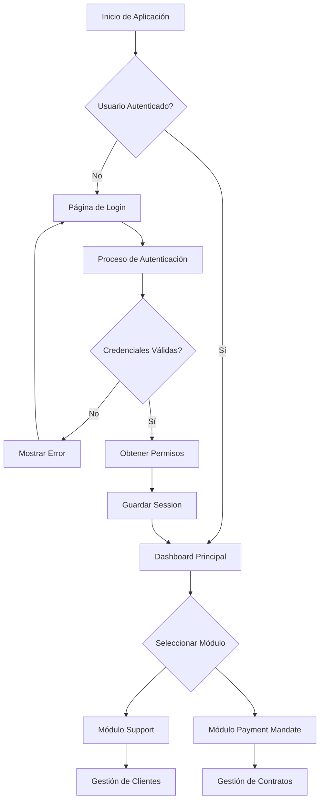
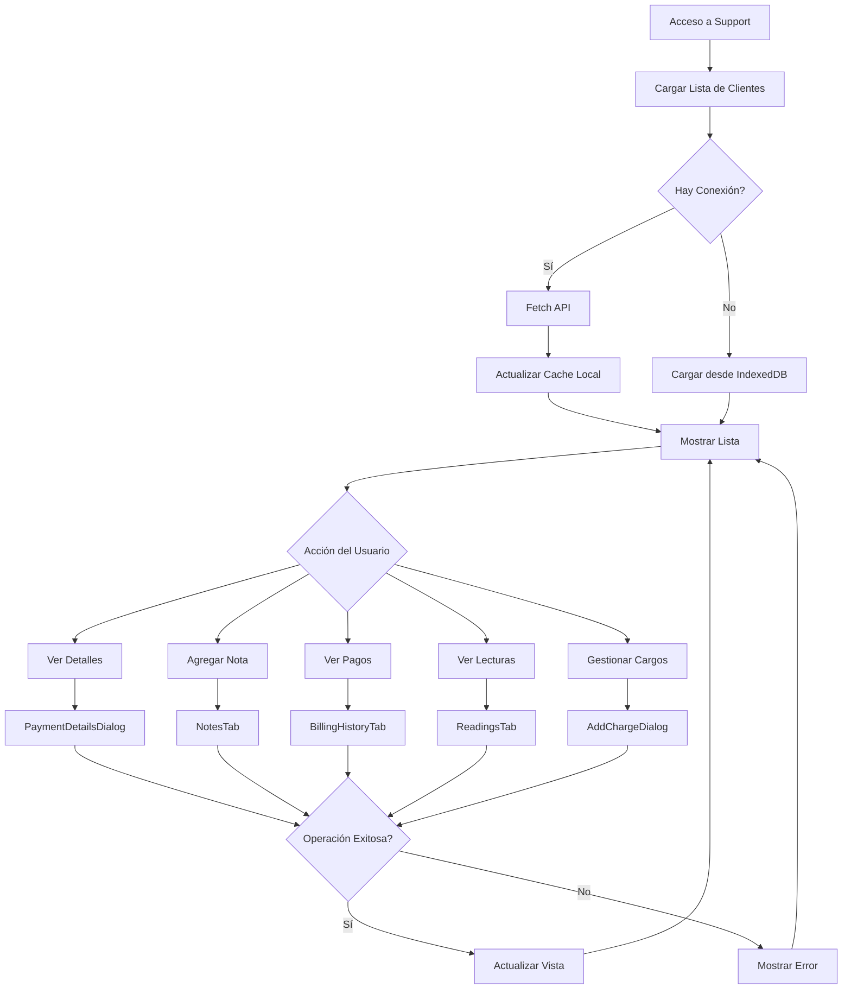
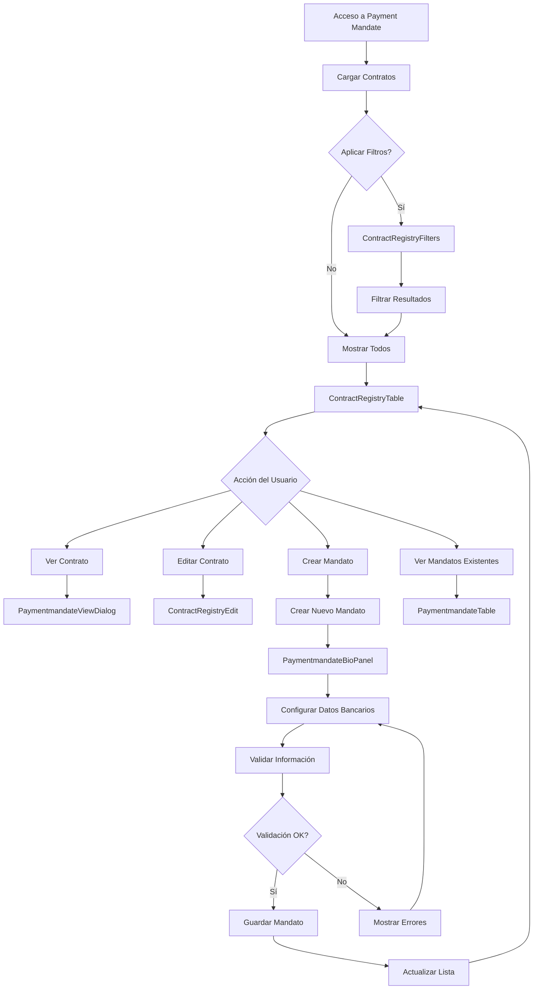
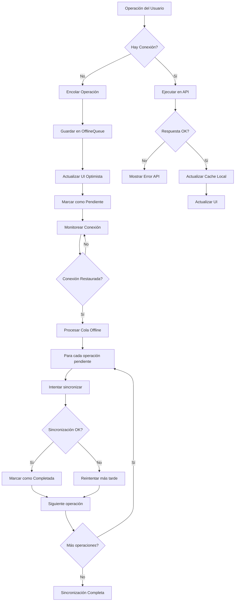
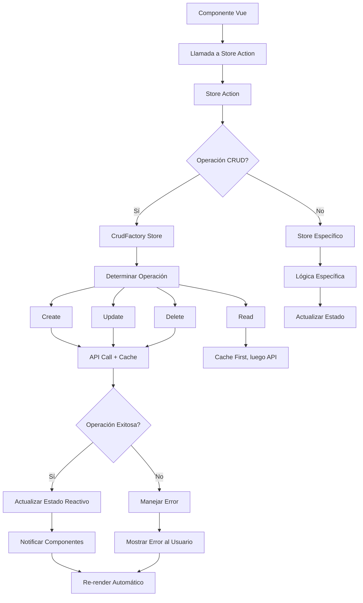
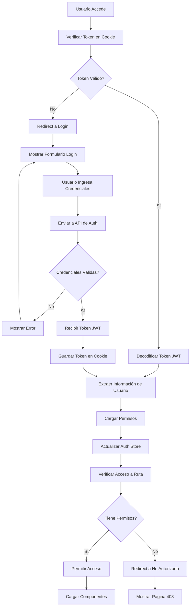

# Documentación del Proyecto ATENCION

## Tabla de Contenidos
1. [Resumen Ejecutivo](#resumen-ejecutivo)
2. [Arquitectura del Sistema](#arquitectura-del-sistema)
3. [Diagramas de Flujo](#diagramas-de-flujo)
4. [Tecnologías Utilizadas](#tecnologías-utilizadas)
5. [Estructura del Proyecto](#estructura-del-proyecto)
6. [Módulos y Funcionalidades](#módulos-y-funcionalidades)
7. [Configuración y Entorno](#configuración-y-entorno)
8. [Guía de Desarrollo](#guía-de-desarrollo)
9. [Patrones de Diseño](#patrones-de-diseño)
10. [Gestión de Estado](#gestión-de-estado)
11. [API y Servicios](#api-y-servicios)
12. [Internacionalización](#internacionalización)
13. [Testing](#testing)
14. [Deployment](#deployment)
15. [Mantenimiento y Escalabilidad](#mantenimiento-y-escalabilidad)

---

## Resumen Ejecutivo

**ATENCION** es una aplicación web moderna desarrollada con Vue.js 3 que implementa un sistema de gestión para empresas de servicios públicos (específicamente para JAPAMA - Junta de Agua Potable, Alcantarillado y Saneamiento). La aplicación está diseñada con una arquitectura escalable que soporta módulos especializados de soporte al cliente y gestión de mandatos de pago.

### Características Principales
- **Arquitectura Modular**: Sistema de módulos independientes y reutilizables
- **Offline-First**: Soporte completo para operaciones sin conexión con IndexedDB
- **Gestión de Servicios Públicos**: Especializado en gestión de agua potable y alcantarillado
- **Responsive Design**: Interfaz adaptable basada en Vuetify 3
- **Internacionalización**: Soporte multi-idioma con Vue i18n
- **TypeScript**: Tipado estático para mayor robustez del código

---

## Arquitectura del Sistema

### Arquitectura General
```
┌─────────────────────────────────────────────────────────────────┐
│                        Frontend (Vue.js 3)                       │
├─────────────────────────────────────────────────────────────────┤
│ Presentation Layer                                              │
│ ├── Components (Vue SFC)                                        │
│ ├── Pages/Views                                                 │
│ └── Layouts                                                     │
├─────────────────────────────────────────────────────────────────┤
│ Business Logic Layer                                            │
│ ├── Stores (Pinia)                                             │
│ ├── Composables                                                │
│ └── Services                                                   │
├─────────────────────────────────────────────────────────────────┤
│ Data Layer                                                      │
│ ├── API Client (ofetch)                                        │
│ ├── IndexedDB (Dexie)                                          │
│ └── WebSocket (Laravel Echo + Pusher)                          │
└─────────────────────────────────────────────────────────────────┘
```

### Patrón de Arquitectura Modular
La aplicación utiliza un patrón de arquitectura modular donde cada módulo de negocio es independiente y contiene:
- **Components**: Componentes específicos del módulo
- **Views**: Páginas y vistas del módulo
- **Stores**: Gestión de estado específica
- **Composables**: Lógica reutilizable
- **Services**: Servicios de datos y API
- **Types**: Definiciones de tipos TypeScript

---

## Diagramas de Flujo

### 1. Flujo Principal de la Aplicación



### 2. Flujo del Módulo Support (Gestión de Clientes)



### 3. Flujo del Módulo Payment Mandate (Gestión de Contratos)



### 4. Flujo de Operaciones Offline



### 5. Flujo de Gestión de Estado (Pinia Stores)



### 6. Flujo de Autenticación y Autorización



---

## Tecnologías Utilizadas

### Framework y Librerías Core
| Tecnología | Versión | Propósito |
|------------|---------|-----------|
| **Vue.js** | 3.5.13 | Framework JavaScript progresivo |
| **TypeScript** | 5.7.3 | Tipado estático |
| **Vite** | 5.4.11 | Build tool y dev server |
| **Vuetify** | 3.7.5 | Framework UI Material Design |
| **Vue Router** | 4.5.0 | Enrutamiento SPA |
| **Pinia** | 2.3.0 | Gestión de estado |

### Librerías de Utilidad
| Tecnología | Versión | Propósito |
|------------|---------|-----------|
| **VueUse** | 10.11.1 | Composables utilitarios |
| **Lodash** | 4.17.21 | Utilidades JavaScript |
| **Day.js** | - | Manipulación de fechas |
| **Yup** | 1.6.1 | Validación de esquemas |
| **VeeValidate** | 4.15.0 | Validación de formularios |

### Integración de Datos
| Tecnología | Versión | Propósito |
|------------|---------|-----------|
| **ofetch** | 1.4.1 | Cliente HTTP |
| **Dexie** | 4.0.10 | IndexedDB wrapper |

### Herramientas de Desarrollo
| Tecnología | Versión | Propósito |
|------------|---------|-----------|
| **ESLint** | 8.57.1 | Linting de código |
| **Prettier** | - | Formateo de código |
| **Vitest** | 3.0.6 | Framework de testing |
| **Cypress** | 14.0.3 | Testing E2E |
| **Stylelint** | 16.8.0 | Linting de CSS |

---

## Estructura del Proyecto

```
frontend/
├── public/                          # Archivos estáticos
├── src/
│   ├── @core/                       # Núcleo de la aplicación
│   │   ├── components/              # Componentes base reutilizables
│   │   ├── composable/              # Composables core
│   │   ├── scss/                    # Estilos base
│   │   ├── stores/                  # Stores globales
│   │   └── utils/                   # Utilidades core
│   ├── @layouts/                    # Layouts base de la aplicación
│   ├── assets/                      # Recursos estáticos (imágenes, estilos)
│   ├── components/                  # Componentes globales
│   ├── composables/                 # Composables globales
│   ├── data/                        # Datos estáticos y mock data
│   ├── helpers/                     # Funciones helper
│   ├── layouts/                     # Layouts específicos
│   ├── modules/                     # Módulos de negocio
│   │   ├── paymentmandate/          # Mandatos de pago y contratos
│   │   ├── support/                 # Soporte al cliente y facturación
│   │   └── template/                # Plantilla base para módulos
│   ├── navigation/                  # Configuración de navegación
│   ├── pages/                       # Páginas principales
│   ├── plugins/                     # Plugins y configuraciones
│   ├── services/                    # Servicios de datos
│   ├── stores/                      # Stores globales (Pinia)
│   ├── types/                       # Definiciones de tipos
│   ├── utils/                       # Utilidades generales
│   ├── validations/                 # Esquemas de validación
│   ├── views/                       # Vistas adicionales
│   ├── App.vue                      # Componente raíz
│   └── main.ts                      # Punto de entrada
├── config/                          # Configuraciones del proyecto
├── cypress/                         # Tests E2E
├── dist/                           # Build de producción
├── scripts/                        # Scripts de automatización
├── stubs/                          # Plantillas para generación de código
├── .env.example                    # Variables de entorno ejemplo
├── package.json                    # Dependencias y scripts
├── tsconfig.json                   # Configuración TypeScript
├── vite.config.ts                  # Configuración Vite
└── vitest.config.ts               # Configuración testing
```

---

## Módulos y Funcionalidades

### 1. Módulo de Soporte (support)
**Propósito**: Sistema de gestión de clientes y facturación para empresas de servicios públicos (específicamente agua).

**Funcionalidades Principales**:
- **Gestión de Pagos**: Visualización de detalles de pagos e historial de facturación
- **Historial de Lecturas**: Seguimiento de consumos y lecturas de medidores
- **Gestión de Notas**: Sistema de anotaciones para seguimiento de clientes
- **Detalles de Convenios**: Administración de acuerdos de pago
- **Diálogos de Facturación**: Gestión de saldos y refacturación
- **Cargos Adicionales**: Sistema para agregar cargos extras a las cuentas

**Componentes Principales**:
- `PaymentDetailsDialog.vue`: Diálogo para mostrar detalles de pagos
- `BillingHistoryTab.vue`: Pestaña de historial de facturación
- `NotesTab.vue`: Pestaña para gestión de notas
- `AgreementDetails.vue`: Detalles de convenios de pago
- `ReadingsTab.vue`: Pestaña de lecturas de medidores
- `AccountBalanceDialog.vue`: Diálogo de balance de cuentas
- `AddChargeDialog.vue`: Diálogo para agregar cargos
- `RebillingDetailDialog.vue`: Diálogo de detalles de refacturación

### 2. Módulo de Mandatos de Pago (paymentmandate)
**Propósito**: Gestión de registros de contratos y mandatos de pago para automatización de cobros.

**Funcionalidades Principales**:
- **Registro de Contratos**: Sistema completo de gestión de contratos de servicios
- **Mandatos de Pago**: Configuración de domiciliación bancaria
- **Filtros Avanzados**: Sistema de búsqueda y filtrado de contratos
- **Gestión de Items**: Administración de elementos asociados a mandatos
- **Panel Biográfico**: Vista detallada de información del contrato

**Componentes Principales**:
- `ContractRegistryTable.vue`: Tabla principal de registros de contratos
- `ContractRegistryFilters.vue`: Filtros para búsqueda de contratos
- `PaymentmandateTable.vue`: Tabla de mandatos de pago
- `PaymentmandateFilters.vue`: Filtros específicos para mandatos
- `PaymentmandateItemsTable.vue`: Tabla de items de mandatos
- `PaymentmandateBioPanel.vue`: Panel biográfico de información
- `PaymentmandateViewDialog.vue`: Diálogo de visualización de mandatos
- `PaymentmandateAccountTab.vue`: Pestaña de información de cuenta

---

## Configuración y Entorno

### Variables de Entorno
```bash
# API Configuration
VITE_API_BASE_URL=https://api-report.japama.net/api
VITE_API_ORGANIZATION=nombre_organizacion

# Google Services
VITE_GOOGLE_MAPS_API_KEY=tu_api_key_aqui

# Mapbox Integration
VITE_MAPBOX_KEY=tu_mapbox_key_aqui
```

### Scripts Disponibles
```json
{
  "dev": "vite",                    // Desarrollo con hot-reload
  "build": "vite build",            // Build de producción
  "preview": "vite preview",        // Preview del build
  "typecheck": "vue-tsc --noEmit",  // Verificación de tipos
  "lint": "eslint . --fix",         // Linting y auto-fix
  "test": "vitest",                 // Tests unitarios
  "test:e2e": "cypress run",        // Tests E2E
  "test:coverage": "vitest run --coverage"  // Cobertura de tests
}
```

### Configuración de Desarrollo
```bash
# Instalación de dependencias
npm install

# Desarrollo local
npm run dev

# Build para producción
npm run build
```

---

## Guía de Desarrollo

### Estructura de un Módulo
Cada módulo sigue una estructura estándar:
```
modules/NombreModulo/
├── components/                      # Componentes específicos
├── composables/                     # Lógica reutilizable
├── stores/                          # Estado del módulo
├── types/                          # Tipos TypeScript
├── views/                          # Vistas del módulo
└── index.ts                        # Exportaciones del módulo
```

### Convenciones de Nomenclatura
- **Componentes**: PascalCase (`UserTable.vue`)
- **Composables**: camelCase con prefijo `use` (`useUserData`)
- **Stores**: camelCase con sufijo `Store` (`userStore`)
- **Types**: PascalCase (`UserData`, `ApiResponse`)
- **Archivos**: kebab-case (`user-management.vue`)

### Generación de Código
El proyecto incluye un generador automático de módulos:
```bash
npm run generate:module
```

Este comando crea la estructura completa de un nuevo módulo con:
- Componentes base (Table, Filters, Form)
- Store con CRUD operations
- Vistas (List, Add, Edit, View, Delete)
- Tipos TypeScript
- Rutas configuradas

---

## Patrones de Diseño

### 1. Factory Pattern - CRUD Store
El sistema utiliza un factory pattern para generar stores CRUD reutilizables:

```typescript
// Ejemplo de uso del CrudFactory
const userStore = createCrudStore<User>({
  id: 'users',
  baseEndpoint: '/users',
  transformFetchListResponse: (data) => ({
    data: data.users,
    total: data.total
  })
})
```

**Beneficios**:
- Código reutilizable
- Consistencia en operaciones CRUD
- Soporte offline automático
- WebSocket integration

### 2. Composition API Pattern
Uso extensivo de composables para lógica reutilizable:

```typescript
// Ejemplo de composable
export function useUserData() {
  const loading = ref(false)
  const users = ref([])

  const fetchUsers = async () => {
    loading.value = true
    // lógica de fetch
    loading.value = false
  }

  return {
    loading: readonly(loading),
    users: readonly(users),
    fetchUsers
  }
}
```

### 3. Plugin Pattern
Sistema de plugins modular para funcionalidades core:

```typescript
// Registro de plugins
registerPlugins(app)
```

### 4. Observer Pattern
Implementado a través de:
- **Pinia** para gestión de estado reactivo
- **Vue's Reactivity System** para componentes reactivos

---

## Gestión de Estado

### Arquitectura de Estado
```
Global State (Pinia)
├── App Store (configuración global)
├── Auth Store (autenticación)
├── Dialog Store (modales globales)
├── Snackbar Store (notificaciones)
└── Module Stores (estado específico de módulos)
```

### Stores Principales

#### 1. App Store (`appStore.ts`)
- Configuración global de la aplicación
- Tema y preferencias de UI
- Estado de carga global

#### 2. Auth Store (`auth.store.ts`)
- Estado de autenticación
- Información del usuario actual
- Permisos y roles

#### 3. Dialog Store (`dialogStore.ts`)
- Gestión de modales globales
- Estado de diálogos de confirmación

#### 4. CRUD Factory (`crudFactory.ts`)
- Factory para crear stores CRUD
- Operaciones estándar (Create, Read, Update, Delete)
- Soporte offline con IndexedDB

### Flujo de Datos
```
Component → Action → Store → API → Store → Component
                      ↓
                  IndexedDB (offline)
```

---

## API y Servicios

### Cliente HTTP
Utiliza `ofetch` como cliente HTTP principal:

```typescript
// Configuración base de API
export const rawApi = $fetch.create({
  baseURL: import.meta.env.VITE_API_BASE_URL,
  headers: {
    'Accept': 'application/json',
    'Content-Type': 'application/json'
  }
})
```

### Servicios Principales

#### 1. API Service (`api.ts`)
- Cliente HTTP configurado
- Interceptors para autenticación
- Manejo de errores global

#### 2. IndexedDB Service (`indexedDbService.ts`)
- Almacenamiento offline
- Sincronización de datos
- Cache inteligente


#### 4. Offline Queue Service (`offlineQueueService.ts`)
- Cola de operaciones offline
- Sincronización automática
- Resolución de conflictos

### Patrón de Requests
```typescript
// Patrón estándar para requests
async function fetchData() {
  try {
    // 1. Verificar cache/offline data
    const cachedData = await db.getData()
    if (cachedData) return cachedData

    // 2. Fetch from API
    const apiData = await rawApi('/endpoint')

    // 3. Update cache
    await db.saveData(apiData)

    return apiData
  } catch (error) {
    // 4. Fallback to offline data
    return await db.getOfflineData()
  }
}
```

---

## Internacionalización

### Configuración i18n
- **Framework**: Vue i18n v10
- **Idiomas soportados**: Español (es), Inglés (en)
- **Lazy loading**: Carga dinámica de traducciones

### Estructura de Traducciones
```
src/plugins/i18n/locales/
├── es/
│   ├── common.json              # Traducciones comunes
│   ├── navigation.json          # Navegación
│   ├── validation.json          # Mensajes de validación
│   └── modules/                 # Traducciones por módulo
│       ├── users.json
│       ├── support.json
│       └── transport.json
└── en/
    └── (misma estructura)
```

### Uso en Componentes
```vue
<template>
  <div>
    <!-- Texto simple -->
    <h1>{{ $t('common.welcome') }}</h1>

    <!-- Con parámetros -->
    <p>{{ $t('user.greeting', { name: userName }) }}</p>

    <!-- Pluralización -->
    <span>{{ $t('items.count', count, { count }) }}</span>
  </div>
</template>
```

---

## Testing

### Estrategia de Testing
La aplicación implementa una estrategia de testing en tres niveles:

#### 1. Unit Tests (Vitest)
- **Cobertura**: Composables, utils, stores
- **Framework**: Vitest con jsdom
- **Ubicación**: `src/**/__tests__/`

```typescript
// Ejemplo de test
import { describe, it, expect } from 'vitest'
import { useUserData } from '@/composables/useUserData'

describe('useUserData', () => {
  it('should fetch users correctly', async () => {
    const { users, fetchUsers } = useUserData()
    await fetchUsers()
    expect(users.value).toBeDefined()
  })
})
```

#### 2. Component Tests (Vue Test Utils)
- **Cobertura**: Componentes Vue
- **Framework**: @vue/test-utils + Vitest

#### 3. E2E Tests (Cypress)
- **Cobertura**: Flujos completos de usuario
- **Framework**: Cypress
- **Ubicación**: `cypress/e2e/`

### Scripts de Testing
```bash
npm run test              # Unit tests en modo watch
npm run test:unit         # Unit tests una vez
npm run test:e2e          # E2E tests
npm run test:coverage     # Cobertura de código
```

### Configuración de Coverage
- **Objetivo**: 80% de cobertura mínima
- **Incluye**: Todos los archivos de src/
- **Excluye**: Types, mocks, test files

---

## Deployment

### Entornos

#### 1. Desarrollo Local
```bash
npm run dev
# Servidor: http://localhost:5173
# Hot-reload: Activado
# DevTools: Activado
```

#### 2. Staging/Preview
```bash
npm run build
npm run preview
# Servidor: http://localhost:5050
# Optimizado: Sí
# Source maps: Sí
```

#### 3. Producción
```bash
npm run build
# Output: dist/
# Minificado: Sí
# Tree-shaking: Sí
# Chunk splitting: Automático
```

### Docker Configuration

#### Desarrollo
```dockerfile
# dev.Dockerfile
FROM node:18-alpine
WORKDIR /app
COPY package*.json ./
RUN npm install
COPY . .
EXPOSE 5173
CMD ["npm", "run", "dev"]
```

#### Producción
```dockerfile
# prod.Dockerfile
FROM node:18-alpine as builder
WORKDIR /app
COPY package*.json ./
RUN npm ci --only=production
COPY . .
RUN npm run build

FROM nginx:alpine
COPY --from=builder /app/dist /usr/share/nginx/html
COPY nginx.conf /etc/nginx/nginx.conf
EXPOSE 80
CMD ["nginx", "-g", "daemon off;"]
```

### CI/CD Pipeline
```yaml
# Ejemplo de workflow
name: Deploy
on:
  push:
    branches: [main]
jobs:
  deploy:
    steps:
      - uses: actions/checkout@v2
      - uses: actions/setup-node@v2
      - run: npm ci
      - run: npm run lint
      - run: npm run test:unit
      - run: npm run build
      - run: npm run test:e2e
      # Deploy to server
```

---

## Mantenimiento y Escalabilidad

### Monitoring y Analytics
- **Performance**: Web Vitals tracking
- **Errors**: Error boundary y logging
- **Usage**: Analytics de funcionalidades

### Optimizaciones

#### 1. Performance
- **Code Splitting**: Lazy loading de rutas y módulos
- **Tree Shaking**: Eliminación de código no utilizado
- **Image Optimization**: Formato WebP, lazy loading
- **Caching**: Service Worker, HTTP cache headers

#### 2. Bundle Size
- **Dynamic Imports**: Carga bajo demanda
- **Vendor Splitting**: Separación de librerías
- **Compression**: Gzip/Brotli en servidor

#### 3. SEO y Accessibility
- **Meta Tags**: Dinámicos por ruta
- **Semantic HTML**: Estructura accesible
- **ARIA Labels**: Soporte para lectores de pantalla
- **Keyboard Navigation**: Navegación completa por teclado

### Escalabilidad

#### 1. Arquitectura Modular
- Módulos independientes y reutilizables
- APIs bien definidas entre módulos
- Lazy loading por módulo

#### 2. State Management
- Stores modulares con Pinia
- Persistencia selectiva
- Optimistic updates

#### 3. API Strategy
- RESTful APIs
- GraphQL ready
- Real-time con WebSockets
- Offline-first approach

### Roadmap Técnico
1. **Q1 2025**: Migración a Vue 3.6
2. **Q2 2025**: Implementación de PWA completa
3. **Q3 2025**: Micro-frontends architecture
4. **Q4 2025**: AI/ML integration

---

## Conclusión

ATENCION representa una solución empresarial moderna y escalable, construida con las mejores prácticas de desarrollo frontend. Su arquitectura modular, soporte offline, y capacidades en tiempo real la posicionan como una plataforma robusta para el crecimiento futuro.

La combinación de Vue.js 3, TypeScript, y un ecosistema bien curado de librerías garantiza un desarrollo eficiente y un mantenimiento sostenible a largo plazo.

### Contacto y Soporte
Para preguntas técnicas o soporte adicional, consultar:
- Documentación técnica en `/docs`


